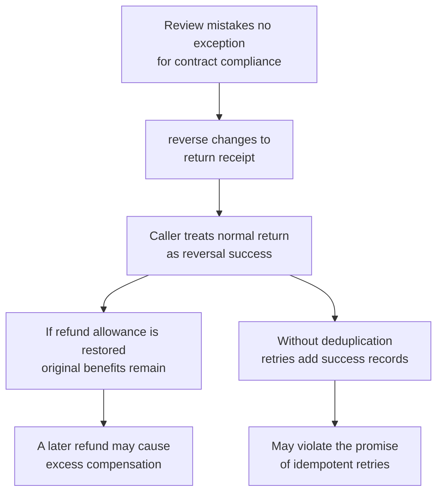
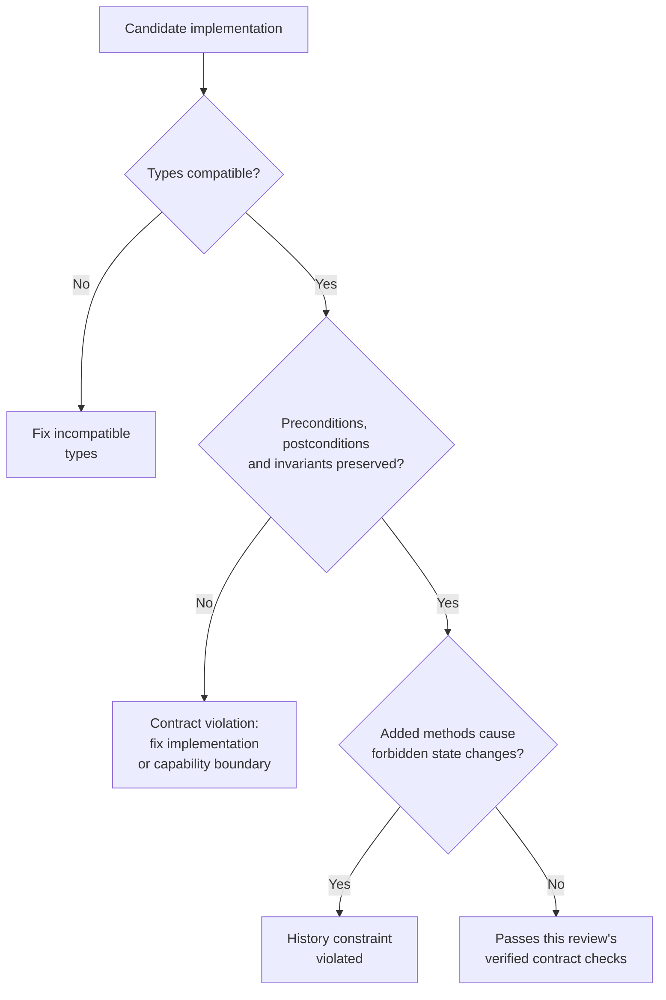

> The sixth of ten notes in the Programming Thinking series. The case the series is built on is in the [opening essay](/notes/programming-taste-in-the-agent-era/).
>
> As AI writes more of our code, the experience and judgement programmers have built up become more valuable. This series is my record of taking these ageing principles back off the shelf and checking their origins, boundaries and failure cases, to see what they can still teach us.

[Note 5](/notes/open-closed-only-the-guessed-axis/) examined a refund system split into separate modules for bank cards, wallets, offline transfers and credit compensation. Credit compensation grants benefits without directly transferring money. Reversing a refund needs to undo the original operation's effect while retaining a traceable record of the reversal.

That article considered a flawed design: adding `reverse` to the shared `RefundChannel` interface, requiring every channel to implement it even when the channel cannot support reversals. This note returns to that design to examine why it can satisfy the types while failing to meet a caller's expectations.

In the third week after refund reversals went live, someone in finance tried to reverse a credit-compensation refund in the back office. The page waited for two seconds, then displayed `UnsupportedOperationError`. The caller used the code below. Assume the channel is registered; the relevant step is the call to `reverse` on the final line.

```ts
async function reverseRefund(r: Refund, reason: string): Promise<ChannelReceipt> {
  const channel = channels.get(r.channel)!
  return channel.reverse(r.receipt, reason)
}
```

The interface declares `reverse` with a return type of `Promise<ChannelReceipt>`, so this call passes type checking. The unit tests covered cards and wallets without exercising credit compensation, and the review missed the gap between the shared interface and the channels' capabilities. These checks missed the problem for different reasons; treating all three as signature checks would obscure those differences.

**Liskov substitution asks whether a caller's reasoning under the original contract still holds when another implementation takes its place.** A method's presence and compatible parameters establish that the call is allowed by the types. Its behaviour after the call needs a contract check as well.

## Preserving the caller's expectations when an implementation changes

Barbara Liskov presented the substitution property in her 1987 OOPSLA keynote, “Data Abstraction and Hierarchy”. I downloaded and read the original. Section 3.3 discusses substitution from the perspective of programs that use a type; the relevant passage is on printed page 25.[1]

Using the paper's notation, for every object o1 of type S, there must be an object o2 of supertype T such that all programs defined in terms of T retain the corresponding behaviour when o1 replaces o2. Under that condition, S can be a subtype of T. The direction of substitution is an S object taking the place of a T object.

Applying this to a design starts with identifying the promises a caller can rely on from T. Implementations can use different data structures, external services and internal algorithms, provided those differences preserve the behaviour the contract allows callers to depend on.

In the same section, Liskov distinguishes behavioural subtyping from the subclass relationships a language provides. Inheritance can implement subtyping, though writing `extends` does not establish behavioural substitutability. Polymorphism through interfaces needs the same check.[1]

Her examples include sets, lists, stacks and queues. Sets usually discard duplicates, whereas lists can retain them; stacks remove elements in last-in-first-out order, and queues in first-in-first-out order. When callers depend on those rules, matching names for add and remove operations cannot make the types interchangeable.

Martin's 1996 article also discusses substitution through the public behaviour clients rely on, including requirements for preconditions and postconditions.[4] Reducing Liskov substitution to matching method signatures loses that part of the original discussion.

## Describing behaviour through four kinds of contract

The substitution property gives us a way to judge compatibility. Checking actual code requires turning behavioural compatibility into specific constraints. Meyer's design by contract and Liskov and Jeannette Wing's formal work on behavioural subtyping provide a basis for doing so.[2][3][5]

The following four categories summarise those constraints in engineering terms. They overlap: one defect may violate both a method's postcondition and an object's invariant.

| Clause | Requirement | Source |
|---|---|---|
| Preconditions | A replacement must accept inputs allowed by the original contract without adding extra requirements | Method rules in design by contract and behavioural subtyping |
| Postconditions | For calls meeting the original preconditions, a replacement must deliver the promised results | Method rules in design by contract and behavioural subtyping |
| Invariants | A replacement must preserve the supertype's constraints on observable state | Design by contract; Liskov and Wing's formal work |
| History constraint | Added operations must preserve the supertype's promised historical properties without introducing forbidden state changes | Liskov and Wing's work on behavioural subtyping, including the 1994 paper and preceding reports |

The history constraint needs the context of aliasing. Two variables can refer to the same object: one uses its supertype interface, while the other can access methods the implementation adds. State changes made through the second variable may be visible through the first. Shared references of this kind are common in JavaScript and TypeScript.[2][3]

For example, an interface might promise an append-only event history. If an implementation adds a method that deletes past events, code using only the original interface can also observe those events disappearing. The question is whether the promise still holds; state changes permitted by the original contract remain valid.

## How the four constraints apply to refunds

The following fragments illustrate possible contract violations, with unrelated imports and members omitted. In these examples, `Money` represents renminbi amounts in integer fen: `10000` means 100 yuan, and 50 yuan is `5000`. Business validation is still needed to check that an amount is valid.

### Does the settlement status agree with its timestamp?

Consider the receipt returned after a refund is submitted. This interface allows two fields to vary independently without expressing their relationship:

```ts
type Money = number

interface ChannelReceipt {
  id: string
  status: 'settled' | 'pending'
  settledAt: Date | null
  amount: Money
}
```

The receipt contract in this example requires a settlement timestamp for settled receipts and `null` for pending receipts. An offline transfer still awaits manual approval after its payment instruction is created. Returning the following object at that point reports settlement too early:

```ts
async submit(req: RefundRequest): Promise<ChannelReceipt> {
  const instruction = await this.createInstruction(req)
  return { id: instruction.id, status: 'settled', settledAt: null, amount: req.amount }
}
```

The `status` says the refund has settled, yet `settledAt` has no value. Each field satisfies its type on its own; together they violate the receipt contract. A caller relying on that contract might write:

```ts
const receipt = await channel.submit(req)
if (receipt.status === 'settled') await ledger.settle(refund.id, receipt.settledAt!)
```

That `!` is mine, added because the original type allows `settledAt` to be `null`. The non-null assertion removes the type warning at this point without supplying a date or rejecting a null value at runtime. The ledger function can therefore still receive `null`.

What happens next depends on the ledger implementation: validation might fail, or it might incorrectly record a settlement. This fragment alone cannot establish that an over-refund will occur. It does establish that the channel has failed to deliver its promised receipt, leaving the caller's reasoning from the settlement status without a reliable basis.

### Does the implementation add an input requirement outside the contract?

Suppose the submission contract accepts every positive amount that passes the other validation rules. Offline transfers require manual approval, with smaller amounts intended to use a separate flow. The implementation instead adds its own minimum of 100 yuan:

```ts
async submit(req: RefundRequest): Promise<ChannelReceipt> {
  if (req.amount < 10000) throw new BelowApprovalThresholdError(req.amount)
  // Remaining submission logic omitted
}
```

A 50-yuan request meeting the original contract is rejected here because the implementation has narrowed the accepted range. If that minimum were already part of the interface's preconditions, rejecting the request could comply with the contract.

An ordinary `number` type does not express this business threshold. Checking method names and parameter types cannot reveal the caller and implementation's different understandings of a valid amount.

### Does the channel preserve the order's refund limit?

The refund system also needs to keep total refunds within the amount originally paid for the order. Each new submission must fit within the remaining refundable amount available when it is submitted. Concurrent requests need a consistent, shared mechanism for checking and reserving that allowance.

A gift card implementation leaves a gap if it skips the system's order-level limit check on the assumption that the gateway will reject invalid transactions. Even when a gateway enforces its own account rules, there is no basis for assuming it knows how much of this order has already been refunded through other channels.

This constraint needs a reliable, unified check in the shared flow or channel implementation. If that check is missing, callers cannot assume the same refund limit will hold when they substitute the gift card implementation. This is a constraint on business state across requests, which receipt field types alone cannot prove.

### Do added methods violate the history contract?

This example also requires refund stage records to be append-only. A reversal adds a new reverse record while preserving the original settlement record. Card callbacks can arrive out of order, so the implementation acquired a recovery method that removes the last stage. Only the added method is shown here; the existing members are omitted:

```ts
class CardChannel implements RefundChannel {
  // This method is absent from the interface
  rollbackLastStage(refund: Refund): void {
    refund.stages.pop()
  }
}
```

Assume the channel retains a reference to this `refund`, and `stagesOf` reads the history from the same record. Two variables referring to the same channel object can then produce this sequence:

```ts
const card = new CardChannel(/* … */)
const asChannel: RefundChannel = card   // One object, two type views

card.rollbackLastStage(refund)
asChannel.stagesOf(refund.id)           // Reads the history with its last stage removed
```

The `card` variable exposes the added method, while `asChannel` exposes only the shared interface. Both operate on the same object and associated state, so code reading through the shared interface also sees fewer stages after the deletion.

That violates the append-only promise. The test is whether observable history still meets the contract; an added method changing state does not automatically make it invalid. Similarly, adding a coordinate-changing method to an immutable point would break its immutability promise. A type that permits coordinate changes has a different contract to check.[2][3]

## What the compiler can check

Some of these business constraints can be represented in types; others need runtime validation, tests or other verification methods. The defects in the fragments above do not make the compiler powerless.

I had assumed enabling `strict` would be enough to reject a narrowed parameter range. Comparing method syntax with function property syntax exposed a distinction that needs separate attention. The examples below were checked with TypeScript 7.0.2 and `strict: true`. All receipt fields are included so the result isolates parameter compatibility.

```ts
interface RefundRequest {
  amount: Money
}

interface TransferRefundRequest extends RefundRequest {
  bankAccount: string
}

interface RefundChannel {
  submit(req: RefundRequest): Promise<ChannelReceipt>
}

class TransferChannel implements RefundChannel {
  async submit(req: TransferRefundRequest): Promise<ChannelReceipt> {
    return {
      id: req.bankAccount,
      status: 'pending',
      settledAt: null,
      amount: req.amount,
    }
  }
}
```

`TransferRefundRequest` requires a `bankAccount` field in addition to the shared request's amount. A request containing only an amount cannot meet that requirement, yet this method implementation passes the check. Changing the interface member to a function property causes the same parameter narrowing to be rejected:

```ts
interface RefundChannelFn {
  submit: (req: RefundRequest) => Promise<ChannelReceipt>
}

const transfer: RefundChannelFn = {
  async submit(req: TransferRefundRequest): Promise<ChannelReceipt> {
    return {
      id: req.bankAccount,
      status: 'pending',
      settledAt: null,
      amount: req.amount,
    }
  },
}
// TS2322: Parameter types are incompatible
```

The TypeScript release notes describe method and constructor declarations as exceptions to strict function parameter checking and explain the connection to compatibility for generic containers.[6] This limits that particular static check; it does not mean every parameter error is accepted.

A general-purpose checker also cannot decide behavioural compatibility in full. Asking one to determine whether an arbitrary method always terminates, for example, encounters undecidability.[7] Specific field relationships, some input constraints and selected operation sequences can still be protected through types or automated checks. Claims about a tool need to identify the part it establishes and the parts it leaves uncovered.

## Why returning an unchanged receipt can be more dangerous

Returning to the failed credit-compensation reversal, the proposed fix in review was to return the receipt unchanged. Throwing `UnsupportedOperationError` failed to meet the caller's expectations, and credit compensation did not directly move money.

```ts
class CreditChannel implements RefundChannel {
  async reverse(receipt: ChannelReceipt): Promise<ChannelReceipt> {
    return receipt
  }
}
```

This code revokes no benefits and creates no reverse record. It makes the method return normally. If the caller treats that return as a successful reversal and updates the allowance or ledger accordingly, a visible failure may become a less noticeable data error.

The diagram retains two possible failure paths. Each depends on particular caller behaviour or missing validation; `return receipt` alone does not establish every outcome shown.



In the first path, the caller restores the refund allowance while the customer retains the original benefits. A later refund could then provide more compensation than the order permits. The second path also requires reversal records to lack deduplication for the same request before repeated calls can add multiple successful records. Allowance and idempotency checks should prevent these risks.

A fix therefore needs to deliver the actual semantics of reversal. A contract that explicitly permits an unsupported result can legitimately reject some operations. A contract promising reversal for all qualifying requests is broken by an implementation that rejects every request. Returning the unchanged receipt cannot stand in for actual success either.

In his discussion of rectangles and squares, Martin assesses a model's validity through how its clients use it.[4] The refund caller needs a trustworthy reversal result. If it needs a special patch to keep working with one implementation of the same type, the stability sought through the open-closed principle also suffers.

## Putting checkable contracts into the implementation

### Express receipt state relationships in types

The earlier `ChannelReceipt` can become a discriminated union, giving settled and pending receipts their appropriate fields:

```ts
type ChannelReceipt =
  | { status: 'settled'; id: string; settledAt: Date; amount: Money }
  | { status: 'pending'; id: string; amount: Money }
```

Under strict type checking, constructing a settled receipt with a `null` timestamp against this definition produces an error. After checking `status === 'settled'`, the caller also gets a `settledAt` of type `Date` without needing a non-null assertion.

This revises the earlier receipt structure. Callers reading pending receipts need to branch on status before accessing fields. External inputs still need runtime validation: `any`, unsafe type assertions and unchecked external data can bypass static guarantees.

### Express reversal support through capability interfaces

For this example, I would keep the shared interface limited to submission and give reversible channels a separate capability interface. The registry below contains only channels that implement reversal:

```ts
interface RefundChannel {
  readonly kind: ChannelKind
  submit(req: RefundRequest): Promise<ChannelReceipt>
}

interface ReversibleChannel extends RefundChannel {
  reverse(receipt: ChannelReceipt, reason: string): Promise<ChannelReceipt>
}

const reversible = new Map<ChannelKind, ReversibleChannel>([
  ['card', new CardChannel(cardGateway)],
  ['wallet', new WalletChannel(ledger)],
])
```

The reversal entry point can centralise the capability lookup so each caller does not need its own check. A dynamic lookup can still find no implementation, so these type declarations do not remove runtime checking. An operation explicitly unsupported by the business also needs to be distinguished from a supported operation missing its configuration.

This follows note 5's approach: establish which capabilities a channel should provide, then connect the implementations. A capability interface constrains members and types; reversal behaviour still needs implementation and verification. If the product requires credit compensation to support reversal, that requires the business capability to revoke benefits, or an explicit change to the requirements. Removing the channel from the registry alone does not fulfil that requirement.

### Run the same contract checks against different implementations

Rules that types cannot currently express need to be documented beside the interface and enforced through implementation checks and tests. Reasonable dependencies in existing callers may already form an implicit contract. Writing it down helps maintainers check against a shared understanding.

Each channel should follow the same contract-checking requirements, with inputs and environments suited to its capabilities. Checks can cover whether qualifying amounts face extra rejection rules, successful receipts meet their state contract, allowance checks prevent over-refunds, repeated reversal requests meet the idempotency promise, and added methods delete history the contract promises to retain.

These checks need to include the previously missed credit-compensation and offline-transfer paths. Channels explicitly lacking reversal support need their rejection behaviour checked; channels promising support need checks of the actual undoing of effects and the reverse records. Passing establishes the expected behaviour for covered scenarios. It cannot prove Liskov substitution for every input and operation sequence.

## Checking whether an implementation can be substituted

When reviewing a new channel implementation, I would locate the contract its callers rely on before working through the questions below. If that contract is unclear, existing callers and business requirements need to be examined first. An unwritten promise can still be a promise.

- Which inputs does the original contract accept? Does the implementation add an amount threshold, required field or call order?
- Once the preconditions are met, which results can callers rely on? Does the implementation deliver the promised settlement status, timestamp and amount?
- Which state constraints must the object or business system maintain? Can other channels or concurrent requests bypass them?
- Which operations does the implementation add? Can they produce observable state changes forbidden by the original contract?

The diagram's three decisions concern type compatibility, the identified state and method contracts, and the history constraint:



This diagram organises a review; it is not an algorithm that proves every behaviour automatically. Each passing result needs a corresponding contract and verification evidence. Unverified behaviour remains a limitation.

## What I changed my mind about

I used to treat Liskov substitution as an inheritance rule, checking whether a subclass changed a base class method's meaning without leaving an explicit contract beside the interface. After reading the original, I start with the reasoning callers make from the type and then check whether another implementation can preserve it.

For this refund system, that means putting receipt state relationships into types, separating reversal capability from ordinary submission, and running shared contract checks against the implementations. Unsupported business operations need an explicit expression of that limit; operations promised but left incomplete need an implementation fix. Making a method stop reporting errors cannot answer either question on its own.

The next note discusses dependency inversion. One question remains here: who should define `ReversibleChannel` so it accurately describes the caller's required capability without turning one channel's current implementation details into constraints every caller must accept?

## References

1. [Barbara Liskov, “Keynote address — Data Abstraction and Hierarchy”, OOPSLA '87 Addendum, ACM SIGPLAN Notices 23(5), 1988, 17–34](https://www.cs.tufts.edu/~nr/cs257/archive/barbara-liskov/data-abstraction-and-hierarchy.pdf). The substitution property [S] appears in section 3.3, printed page 25 (PDF page 9). The section distinguishes behavioural subtypes from language subclasses and discusses specifications that allow exceptions.
2. [Barbara Liskov and Jeannette Wing, “A Behavioral Notion of Subtyping”, ACM TOPLAS 16(6), 1994, 1811–1841](https://dl.acm.org/doi/10.1145/197320.197383). Method rules, invariants and history constraints; a [PDF is available from Wing's university](https://www.cs.cmu.edu/~wing/publications/LiskovWing94.pdf). Related technical reports preceded the paper, so the rules' origins should not all be dated to 1994.
3. [Gary T. Leavens and Krishna K. Dhara, “Concepts of Behavioral Subtyping”, in *Foundations of Component-Based Systems*, Cambridge University Press, 2000](https://www.eecs.ucf.edu/~leavens/FoCBS-book/06-leavens-dhara.pdf). Compares definitions of behavioural subtyping and their treatment of aliasing and mutable state.
4. [Robert C. Martin, “The Liskov Substitution Principle”, *C++ Report*, March 1996](https://objectmentor.com/resources/articles/lsp.pdf). Explains model validity through clients and discusses preconditions, postconditions and the relationship between LSP and OCP.
5. [Bertrand Meyer, *Object-Oriented Software Construction*, Prentice Hall, 1988](https://dl.acm.org/doi/book/10.5555/534431). A historical source for design by contract. The original book was not checked directly for this revision; the descriptions here draw on the papers and survey above.
6. [TypeScript 2.6 release notes: strict function types](https://www.typescriptlang.org/docs/handbook/release-notes/typescript-2-6.html). The checking exceptions for method and constructor declarations. This article's examples were separately checked with TypeScript 7.0.2.
7. [Liskov substitution principle — Wikipedia](https://en.wikipedia.org/wiki/Liskov_substitution_principle). Supplementary explanation of general undecidability and the termination example. It is not used as a historical source or as evidence that no contracts can be checked automatically.
