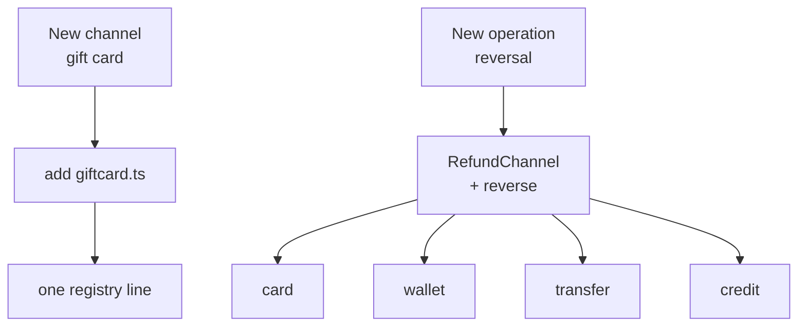
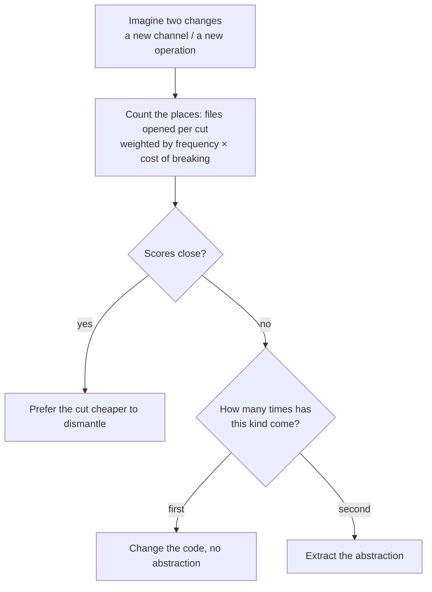

> The fifth of ten notes in the Programming Thinking series. The case the series is built on is in the [opening essay](/notes/programming-taste-in-the-agent-era/).
>
> AI can write more of our code every month, which makes the judgement we have built up worth more, not less. This series is me taking these ageing principles back off the shelf, checking where each one came from, where it holds, and where it breaks. Reviewing the old to understand the new.

The `RefundHandler` from [note 2](/notes/what-belongs-in-one-module/) ended up split into four channel modules, each carrying its own timeout, retry, and idempotency policy. Three months after the split, two things arrived.

The first was a new channel: gift cards. One new file, one implementation of the interface, one line in the registry, and the submission flow was untouched. Half a day of work, tests written and all.

The second was a new operation: reversal. Finance wanted settled refunds to be revocable, the reversal recorded against the third invariant from the opening essay. The change ended up touching five files: the interface, one per channel implementation, and in the credit-compensation file the method body was a single `throw`.

The same design takes new files in one direction and rewrites every file in the other. **The split was not wrong; it was only ever open along one axis.** That is where the open-closed principle gets hard.

## The half day a channel took

The shape after the split:

```ts
interface RefundChannel {
  readonly kind: ChannelKind
  submit(req: RefundRequest): Promise<ChannelReceipt>
}

const channels = new Map<ChannelKind, RefundChannel>([
  ['card', new CardChannel(cardGateway)],
  ['wallet', new WalletChannel(ledger)],
  ['transfer', new TransferChannel(approvalFlow)],
  ['credit', new CreditChannel(couponStore)],
])

async function submitRefund(req: RefundRequest): Promise<ChannelReceipt> {
  const channel = channels.get(req.channel)
  if (!channel) throw new UnknownChannelError(req.channel)
  return channel.submit(req)
}
```

Adding a gift card took exactly this:

```ts
class GiftCardChannel implements RefundChannel {
  readonly kind = 'giftcard' as const
  constructor(private gateway: GiftCardGateway) {}

  async submit(req: RefundRequest): Promise<ChannelReceipt> {
    // redeem back onto the card, fail the whole refund on insufficient balance
  }
}
```

One literal added to `ChannelKind`, one line added to `channels`. Not one of the original four files was opened.

This is the scene Meyer's sentence from 1988 describes: **new requirements are met by adding code, and what is already written and running stays untouched.**

## A reversal opened five files

```ts
interface RefundChannel {
  readonly kind: ChannelKind
  submit(req: RefundRequest): Promise<ChannelReceipt>
  reverse(receipt: ChannelReceipt, reason: string): Promise<ChannelReceipt>
}
```

Each of the four implementations grew a method. The credit-compensation one:

```ts
class CreditChannel implements RefundChannel {
  async reverse(): Promise<ChannelReceipt> {
    throw new UnsupportedOperationError('credit')
  }
}
```

The trouble lands in three places. The interface now carries a method not every implementation supports. Callers have to work out for themselves which channels can reverse. And the most practical one: this change opened five files, four of them live and carrying real money.

Put the two changes side by side:



The left chain is all new things. On the right, besides the interface, four files had to be opened, and `credit.ts` was opened to write a single `throw`.

The same action, "add one kind of thing": one file the first time, five files the second. **This change hit the back of the design, and it has nothing to do with how well the code was written.**

An obvious objection: extract a `ReversibleChannel` interface, let the two channels that can reverse implement it, leave credit and transfer out, and you no longer touch five files. True, five drops to three. The costs come with it: callers must first judge whether a given ledger entry can be reversed at all, and that judgement spreads to every call site. When the next operation arrives, the whole move has to be made again. **Extracting the interface solves this instance, not the class.**

## Two generations, both answering how to extend

The opening essay checked where this principle came from. Meyer wrote the sentence in *Object-Oriented Software Construction* in 1988, and the mechanism was inheritance from concrete classes: a class is compiled into a library and used by others, new classes take it as a parent and add features, and neither the original class nor its clients change [1]. In January 1996 Martin rewrote it in the C++ Report, and the mechanism became abstract interfaces with polymorphism: clients depend on the abstraction, and new behaviour arrives as new implementations [2].

**The two versions answer "how to extend" differently, and neither answers "extend in which direction".** The opening essay left a thread there, promising that these two kinds of extension points fail differently and in two different notes. Here is Meyer's half: when the extension point sits in an inheritance hierarchy, subclasses inherit the parent's internal assumptions, a change to the parent breaks them, and the parent usually has no idea which subclasses exist. That thread comes back in note 10 on composite reuse.

Martin's half is for the next note. But the same article contains one more sentence, and that sentence is the usable part of this principle.

## Closure can only be strategic

> It should be clear that no significant program can be 100% closed. … Therefore, closure cannot be complete; it must be strategic. That is, the designer must choose the kinds of changes against which to close his design. This takes a certain amount of prescience derived from experience.[3]

**The sentence demotes the open-closed principle from an acceptance criterion to a bet.** Bet right, and a new requirement is one new file. Bet wrong, and the abstraction becomes the obstacle the next change has to work around.

About the quote: the original PDF on objectmentor.com and its archived snapshots are both unreachable now. What I have are several mutually consistent secondary transcriptions, and the wording is treated as such.

## Rows and columns: you can only pick one

In November 1998 Philip Wadler sent the java-genericity mailing list a message titled The Expression Problem. He put the problem as a table:

> One can think of cases as rows and functions as columns in a table. In a functional language, the rows are fixed (cases in a datatype declaration) but it is easy to add new columns (functions). In an object-oriented language, the columns are fixed (methods in a class declaration) but it is easy to add new rows (subclasses).[4]

In the refund system, **channels are rows and operations are columns**. The cut above was by channel: adding a row, a new channel, means adding one file, while adding a column, a new operation, means filling in every row.

Try cutting by column instead. Channels become a discriminated union, operations live one per file:

```ts
type Refund =
  | { kind: 'card'; receiptId: string; settledAt: Date }
  | { kind: 'wallet'; entryId: string }
  | { kind: 'transfer'; instructionId: string; approved: boolean }
  | { kind: 'credit'; couponId: string }

// reverse.ts
export function reverse(r: Refund): Refund {
  switch (r.kind) {
    case 'card':
      return { kind: 'card', receiptId: r.receiptId, settledAt: new Date() }
    case 'wallet':
      return { kind: 'wallet', entryId: r.entryId }
    case 'transfer':
    case 'credit':
      throw new UnsupportedOperationError(r.kind)
  }
}
```

A reversal is now one new file. Adding a gift card means opening every operation file and adding a branch to every `switch`. **The cost has flipped to the other side.**

Change the cut and the N moves to the other cell:

| Cut | Add a channel (new row) | Add an operation (new column) |
| --- | --- | --- |
| By channel, one class per channel | add 1 file | change N channel classes |
| By operation, one function per operation | change N operation files | add 1 file |

The "1" on the diagonal and the "N" in the other half are two faces of the same thing. **Choosing the axis is choosing which cell's N shows up more often and costs more to break.**

One premise sits under the code above: the `switch` deliberately has no `default: throw`. Once a new channel arrives it is no longer exhaustive, the return type stops matching, and TypeScript reports an error in every operation file that missed the case. Add a catch-all branch to save the trouble and the compile goes quiet, leaving the problem for production. **Exhaustiveness checking is not free. It demands that every case be written, not caught.**

One more thing, a difference I assumed existed and found did not. I thought the union version had exhaustiveness checking that the polymorphic version lacked. Checked, both have it: add a method to the interface, and classes that do not implement it fail to compile in exactly the same way. The compiler reports as much on either side; what differs is what gets missed. The polymorphic version misses "some channel has not implemented this new operation". The union version misses "some operation has not handled this new channel". **Choosing the axis is choosing which kind of omission you would rather be named for.**

Note 2 cited Parnas's criterion from 1972: draw boundaries along the decisions most likely to change. The step to add here: **count the axes first, then decide which one is most likely.**

## Does a switch violate it or not

The `switch` in note 2's `RefundHandler` did have a problem, but the reason given there was logical cohesion: the four branches shared neither failure modes nor idempotency practice. The criterion lives somewhere else entirely, and it is not the shape of the code.

The criterion is how many copies of this kind of branching exist, and how many files open when a case arrives. **A central `switch` takes one edit per case; four classes with one method each take five.** The compiler helps on both sides. What it cannot help with is the number of places touched.

So "seeing a switch means the open-closed principle is violated" is too coarse. **It takes the shape of the code for the criterion, when the shape is only a consequence of the count.**

## "No modification" fails as an acceptance criterion

Read the principle as "never touch old code" and the execution is an interface in front of every seam. The bill has two lines. The abstraction is itself a dependency, which note 3 counted. And an unused extension point holds its place until the change you actually need arrives, at which point it is the thing standing in the way.

**The two lines together are exactly the opposite of what the principle exists to prevent: code that is harder to change than if the principle had been ignored.** The abstractions stopped no change that actually happened; they added one more detour to the next one. The opening essay's line about copying principles producing anti-principle code is easiest to verify on this one, because laying down interfaces looks compliant while you are doing it.

Martin has a usable timing test, from *Agile Software Development*:

> There is an old saying: "Fool me once, shame on you. Fool me twice, shame on me." … we initially write our code expecting it not to change. When a change occurs, we implement the abstractions that protect us from future changes of that kind. In short, we take the first bullet, and then we make sure we are protected from any more bullets coming from that gun.[5]

The first time a change of this kind appears, change the code directly. The second time the same kind arrives, extract the abstraction that guards against it. **The rule turns "should we lay down an abstraction" from a matter of taste into a matter of counting: count to two.**

## After a wrong guess, keep adding

**Abstraction is not a one-way door.** With clean file boundaries, taking an interface down and gathering the branches back is usually cheaper than spreading it was. Only one case is truly expensive: someone else already depends on the extension point, and removing it means touching the callers too.

Whether it can be taken down is visible at the moment you choose the cut. How many callers the interface has, and whether they are maintained by your own team or another team, decides whether a wrong bet can be walked back.

## A test you can run on the spot

- **Count the places.** Imagine both changes, a new channel and a new operation, and count how many files each cut opens. Compare the numbers, not the elegance.
- **Rank the risk.** By how often the change comes, times what it costs to break once. Reversal touches money, and opening four live channel implementations at once costs far more than adding one new channel file. In the refund system, operations are the main axis of change.
- **Abstraction lands on the second shot.** First time, change directly. Second time the same kind arrives, extract.
- **Keep an exit.** When the counts are close, prefer the cut that is cheaper to dismantle.

The first two decide the cut. The last two decide when to cut, and what to do after a wrong guess. The four are not a flat checklist; they run in order:



Two forks only: when the counts are close, look at the exit cost; when they are not, look at how many times this kind of change has come before.

## What this note concludes

- **Open-closed is not a state you can reach; it is a bet.** No significant program can be 100% closed. The designer only picks which kinds of changes to close against, and picking takes prescience, which comes from experience.
- **Open along one axis means closed along the other.** In the refund system channels are rows and operations are columns; either cut makes one direction "add a file" and the other "change N files".
- **The criterion is counting the places, not reading the shape.** A central `switch` takes one edit per case; four classes with one method each take five.
- **"A switch means open-closed is violated" is too coarse.** The shape is a consequence of the count, not the criterion itself.
- **Abstraction lands on the second shot.** First time, change directly; second time, extract. This turns "should we lay down an abstraction" from taste into counting.
- **Abstraction is not a one-way door.** With clear boundaries, dismantling is usually cheaper than spreading was. A wrong bet you keep building on is what turns one misjudgement into a standing cost.
- **Read "no modification" as an acceptance criterion and you produce the opposite of the principle.** The interfaces laid down stopped no real change; they added one more detour to the next one.

## What I changed my mind about

I used to treat open-closed as an acceptance criterion: touching old code meant the design had failed, so every seam got an interface, and after laying them I could not have said which changes they were guarding against.

The criterion is now one sentence: **how many files does this change open**. A large number means the change landed on the back of the design, so either change the cut or accept that this time the code should change. A wrong bet is nothing to be ashamed of; with clear boundaries, dismantling is cheaper than spreading was. A wrong bet you keep building on is what turns one misjudgement into a standing cost.

The next note covers Liskov substitution. Martin's version of open-closed runs on polymorphism, and **whether a new implementation can actually replace the old one is something the open-closed principle never checks**. The `CreditChannel.reverse` above, which only throws, has a perfectly legal signature.

## References

1. [Bertrand Meyer, *Object-Oriented Software Construction*, Prentice Hall, 1988](https://dl.acm.org/doi/book/10.5555/534431). The original definition of "open/closed" is on p. 23 and the inheritance mechanism on p. 229; page numbers and quotes checked against [the Wikipedia article on the OCP](https://en.wikipedia.org/wiki/Open%E2%80%93closed_principle). The book itself was not retrieved.
2. [Robert C. Martin, "The Open-Closed Principle", *C++ Report*, January 1996](https://en.wikipedia.org/wiki/Open%E2%80%93closed_principle). Year and venue checked the same way; the original PDF (objectmentor.com) is offline.
3. Same source as 2, the passages on "no significant program can be 100% closed" and "closure … must be strategic". Secondary transcriptions at [a full quotation on Software Engineering Stack Exchange](https://softwareengineering.stackexchange.com/a/406376) and [an enjoyalgorithms repost](https://enjoyalgorithms.com/blog/open-close-principle).
4. [Philip Wadler, "The Expression Problem", java-genericity mailing list, 1998-11-12](https://homepages.inf.ed.ac.uk/wadler/papers/expression/expression.txt). The rows-and-columns metaphor opens this email.
5. [Robert C. Martin, *Agile Software Development, Principles, Patterns, and Practices*, 2002](https://www.pearson.com/en-us/subject-catalog/p/agile-software-development-principles-patterns-and-practices/P200000009301). The "Fool me once" passage as transcribed at [Fanciful Magic, 2003](http://blabux.blogspot.com/2003/11/fool-me-once.html). The book itself was not retrieved.
6. [D. L. Parnas, "On the Criteria To Be Used in Decomposing Systems into Modules", CACM 15(12), 1972](https://dl.acm.org/doi/10.1145/361598.361623). Used in note 2.
