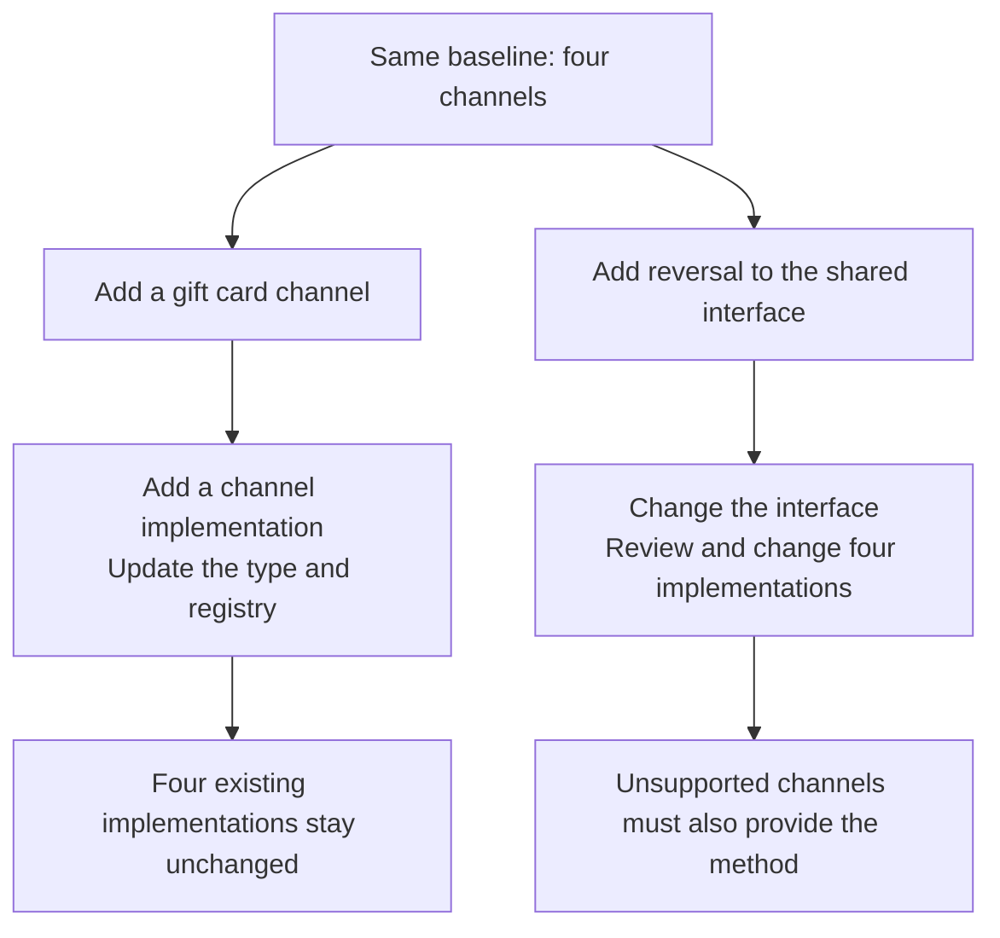
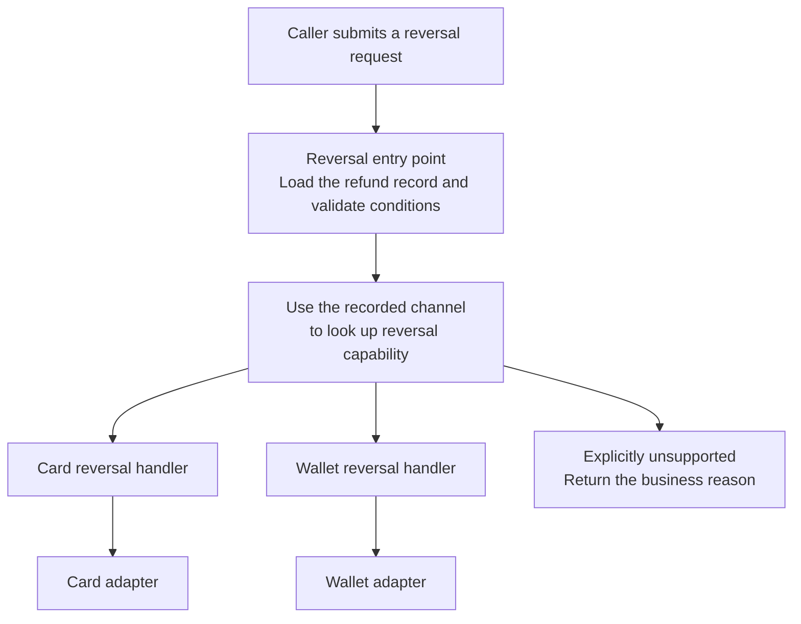
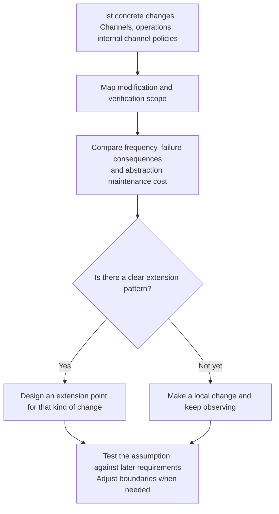

> The fifth of ten notes in the Programming Thinking series. The case behind the series is in the [opening essay](/notes/programming-taste-in-the-agent-era/).
>
> As AI writes more of our code, the experience and judgement programmers have built up become more valuable. In this series, I revisit these ageing principles, trace their sources, and examine where they hold and where they break. Returning to the old ideas helps me make sense of the new ones.

In [note 2](/notes/what-belongs-in-one-module/), I discussed a refund-handling module called `RefundHandler`. Its logic was later divided into four modules for bank cards, wallets, offline transfers, and credit compensation. Each module was responsible for its channel's timeout, retry, and idempotency policies.

Three months after the refund logic was split into channel modules, the product manager requested two additions: a gift card refund channel and a reversal operation for each refund channel.

Integrating the gift card channel required a new channel implementation and an entry in the registry. This work took half a day, including tests, and left the existing refund submission flow unchanged.

The reversal requirement reached further into the design. Under this refund system's business rules, reversing a settled refund creates an offsetting record and preserves the original. Adding reversal to the interface shared by all channels would require reviewing and changing the existing channel implementations one by one.

Why does the same design accommodate one requirement easily while another reaches into several modules? The requirements change different parts of the model: one adds a kind of channel, while the other gives channels a new operation. I will refer to these as two axes of change.

**The open-closed principle needs a specific question: for which kind of change can which existing code remain stable?** Naming both the change and the code gives us something concrete to assess.

## Adding a channel: changes stay at the point of integration

The refund code separates dispatch from processing: the caller uses the request to find the appropriate channel, then delegates the refund to that channel's module. This division is enough to understand which parts of the code a new requirement affects, without reading the earlier notes.

This code sketches the structure. It omits the request and receipt fields, along with each channel's internal implementation, so that we can compare the scope of changes. It is not a complete payment implementation.

```ts
interface RefundChannel {
  readonly kind: ChannelKind
  submit(req: RefundRequest): Promise<ChannelReceipt>
}

const channels = new Map<ChannelKind, RefundChannel>([
  ['card', new CardChannel(cardGateway)],
  ['wallet', new WalletChannel(ledger)],
  ['transfer', new TransferChannel(approvalFlow)],
  ['credit', new CreditChannel(couponStore)],
])

async function submitRefund(req: RefundRequest): Promise<ChannelReceipt> {
  const channel = channels.get(req.channel)
  if (!channel) throw new UnknownChannelError(req.channel)
  return channel.submit(req)
}
```

The last line shows what the caller depends on. `submitRefund` calls `submit` without needing to know how bank cards and wallets process their refunds.

If the gift card channel can honour the submission contract defined by `RefundChannel`, a new `GiftCardChannel` can implement it. Connecting that implementation to the submission flow also requires adding `'giftcard'` to `ChannelKind` and an instance to the `channels` registry.

The type declaration and registry still change. The parts that stay stable are the dispatch logic in `submitRefund` and the four existing channel implementations. The new implementation also needs tests, including checks that it works when connected to the submission flow.

**The benefit is that integrating the new channel leaves the existing channel implementations intact.** A channel that needs a different submission contract may require us to reconsider the interface itself.

## Adding an operation: existing implementations change together

To compare the two changes consistently, each example starts from the original four-channel version. If gift cards have already been integrated, they also need to be counted when a shared method is added.

One direct way to implement the product manager's reversal requirement is to add a `reverse` method to `RefundChannel`, the interface shared by all refund channels:

```ts
interface RefundChannel {
  readonly kind: ChannelKind
  submit(req: RefundRequest): Promise<ChannelReceipt>
  reverse(receipt: ChannelReceipt, reason: string): Promise<ChannelReceipt>
}
```

This declaration requires every channel to provide `reverse`. With one interface file and one implementation file per channel, there are five places to review: the interface and four implementations. Callers, tests, and integration configuration are additional work.

In this example, bank cards and wallets support reversal; offline transfers and credit compensation do not. Requiring the latter two to implement the method anyway can produce code like this in the credit compensation class. The excerpt shows only the new method; the other members are omitted.

```ts
async reverse(): Promise<ChannelReceipt> {
  throw new UnsupportedOperationError('credit')
}
```

A method that always throws can pass type checking, yet callers cannot tell from the `RefundChannel` type which channels can complete a reversal. Adding the method therefore creates two jobs: updating the implementations and deciding where to handle unsupported operations.

The different scopes of the two changes are visible in the diagram:



The diagram compares changes within this particular design. Organising the code by channel makes adding channels convenient, while the work of adding a shared operation is spread across the implementations.

## Where changes go when the code is organised differently

Refund logic can be represented as a table. Each row is a channel, each column is an operation, and each cell describes how that channel performs that operation.

| Channel | Submit a refund | Reverse a refund |
|---|---|---|
| Bank card | Card submission logic | Card reversal logic |
| Wallet | Wallet submission logic | Wallet reversal logic |
| Offline transfer | Transfer submission logic | Unsupported in this example |
| Credit compensation | Credit submission logic | Unsupported in this example |

Each channel class keeps that channel's operations together, corresponding to one complete row in the table. Adding a channel therefore concentrates the new logic in a new class, while adding a shared operation requires supplying implementations across the existing channel classes.

Another option is to keep each column together. Channel data becomes a discriminated union, with a separate entry point for each operation, such as `submit` or `reverse`. The code below shows only how the reversal entry point dispatches calls. The existing `cardGateway` and `ledger` adapters perform the offsetting entries.

```ts
type Refund =
  | { kind: 'card'; receiptId: string; settledAt: Date }
  | { kind: 'wallet'; entryId: string }
  | { kind: 'transfer'; instructionId: string; approved: boolean }
  | { kind: 'credit'; couponId: string }

// reverse.ts: dispatch only; imports and adapter internals are omitted
export async function reverse(
  r: Refund,
  reason: string,
): Promise<ChannelReceipt> {
  switch (r.kind) {
    case 'card':
      return cardGateway.reverse(r.receiptId, reason)
    case 'wallet':
      return ledger.reverse(r.entryId, reason)
    case 'transfer':
    case 'credit':
      throw new UnsupportedOperationError(r.kind)
    default:
      return assertNever(r)
  }
}

function assertNever(value: never): never {
  throw new Error('Unhandled refund channel')
}
```

Here, `reverse.ts` collects the dispatch decisions for how each channel responds to a reversal request. The existing submission entry point stays unchanged. Any adapter that lacks reversal support still needs that implementation, so creating the dispatch file alone does not complete the business requirement.

With this organisation, adding gift cards requires extending `Refund` and reviewing every operation that branches by channel. The two basic approaches have the following costs:

| Organisation | Add a channel | Add an operation |
|---|---|---|
| By channel, one class per channel | Add a channel implementation; update the type and integration configuration | Change the shared interface; review N channel implementations |
| By operation, one entry point per operation | Extend the union type; review M operation entry points | Add an operation entry point and the required business logic |

N is the number of channels; M is the number of operations. The table compares the review and modification scope created by the code's organisation. Tests, adapter internals, and deployment work need to be counted separately.

In his 1998 email *The Expression Problem*, Philip Wadler used rows and columns to explain this tension. He asked how a design could support adding both data variants and operations while retaining properties such as static type safety and separate compilation.[4]

The table therefore applies to the two basic approaches shown here. It does not establish that every design can accommodate only one direction of change. More elaborate mechanisms can alter the trade-off, and their additional costs need assessment too.

### Having the compiler identify omissions

The `assertNever` call checks whether the code handles every member of the union. After all existing branches have been handled, the remaining type should be `never`. If `'giftcard'` is added without a corresponding branch, the value passed to `assertNever` can still be a gift card, and TypeScript reports a type error.[7]

An ordinary `default: throw` catches every omitted case and removes that check. The `default: return assertNever(r)` above explicitly asks the compiler to verify that no cases remain. Another approach is to omit `default`, enable `strictNullChecks`, and declare a return type that excludes `undefined`. Those conditions affect whether the compiler can report the omission.[7]

I originally thought that detecting omissions was a benefit unique to the union version. On checking, I found that adding a required interface method also causes a compilation failure in classes that explicitly implement the interface and omit that method.

The two checks catch different omissions: an operation that misses a new channel, or a channel that misses a new operation. Neither can determine from a signature alone whether reversal works correctly. The method that always throws demonstrates that limitation.

## The open-closed principle protects against selected changes

The phrase “open for extension, closed for modification” becomes more concrete when applied to a particular module. When gift cards are added, `submitRefund` can invoke the new behaviour while retaining its existing dispatch code.

When Meyer introduced the principle in 1988, inheritance was the main extension mechanism under discussion. Martin later explained how abstract interfaces and polymorphism could keep clients stable.[1][2] The `RefundChannel` example follows that second approach. The boundary problems caused by changes in a parent class affecting its subclasses will return in note 10, on composition and reuse.

In the “Strategic Closure” section of his 1996 article, Martin already acknowledged that a significant program cannot be closed against every change. Designers have to choose the kinds of change to protect against.[3] If the selected direction is adding channels, the shared submission interface can stay stable. Supporting a growing set of operations may call for a different organisation.

Changing an existing file is therefore insufficient evidence of a design failure. In 2013, Martin also clarified his earlier, forceful wording: he wanted anticipated changes in behaviour to avoid widespread changes throughout a system. He was not demanding an end to source-code modification.[8]

That goal is more useful than a target of “one new file”. Adding a registry entry and rewriting settlement logic both modify existing files, yet their risks can differ considerably.

## Interfaces and switches need a defined scope

The shared interface requires every channel to have `reverse`, although only two channels support it in this example. Reversal could instead be represented by a separate `ReversibleChannel` interface, which callers that need reversal would depend on.

Separating reversal capability from the general channel interface would remove the need for credit compensation and offline transfers to add throwing methods merely to satisfy the type. The logic that determines whether a channel supports reversal could also be concentrated in an entry point or registry, without being repeated by every caller.

This is a reasonable improvement because it expresses reversal support more accurately. The bank card and wallet reversal logic still needs to be written and tested. If new operations keep arriving, the maintenance cost of the capability interfaces and their implementations also needs assessment.

Assessing whether a `switch` is appropriate also requires looking at its responsibilities. If the entry point containing the `switch` only selects a channel, it can delegate business behaviour to channel adapters. If the same function also handles timeouts, retries, approval, and bookkeeping, changes to those rules are more likely to affect one another.

Note 2 separated channels to isolate changes to their internal policies. This note compares operations to show the cost of adding shared behaviour. Both needs can exist together: operation entry points can handle dispatch while channel modules retain their business details. Whether that combination is worthwhile depends on whether it reduces the maintenance work the system needs.

A useful review of a `switch` follows a concrete change through the code. Which branches need updating when a channel is added? Which paths are affected by a change to approval rules? How much must callers know about individual channels? These answers reveal more about the design than its syntax alone.

## The design I would choose when both channels and operations grow

If this refund system is already adding channels and operations on an ongoing basis, I would retain independent channel adapters, give each operation its own entry point, and connect them through explicit capability registration. This is a design recommendation for the example in this article. Its aim is to give new behaviour a clear place to live while limiting its impact on existing behaviour.

The design separates three responsibilities. Channel adapters retain external dependencies, such as the card gateway and wallet ledger, along with their internal policies. Operation entry points define each operation's request, result, and workflow. Registration records whether a channel supports an operation and, when it does, which handler should perform it.

For a reversal, the call path could look like this:



The entry point determines the channel from the refund record before calling the corresponding handler. The card handler can reuse the card adapter, and the wallet handler can reuse the wallet's ledger logic. This gives reversal a central entry point while preserving clear ownership of each channel's timeout, retry, and idempotency policies.

The following layout shows where the responsibilities could live. Short handlers can stay within an operation module; separate files are useful only when they help organise the implementation.

```text
refund/
  channels/
    card.ts                 Card adapter and internal policies
    wallet.ts               Wallet adapter and internal policies
  operations/
    submit.ts               Existing submission entry point and contract
    reverse.ts              Reversal entry point and contract
    reverse/
      card.ts               Card reversal handler
      wallet.ts             Wallet reversal handler
  composition.ts            Capability registration and handler wiring
```

`submit` and `reverse` retain their own request and result types. `composition.ts` brings their separate registrations together without forcing every operation into a universal interface that accepts arbitrary arguments. Types and entry-point validation still need to preserve the relationship between a channel and its receipt. Introducing a registry does not remove those constraints.

Registration needs to distinguish three states: supported with a handler, explicitly unsupported for a business reason, and not yet configured. The first two are complete capability decisions; the third is an omission to fix. If the product requirement says a channel must support reversal, that capability must be implemented or the scope explicitly renegotiated. Configuring it as unsupported does not fulfil the requirement. The registry can supply the runtime capability list, but acceptance checks also need independently agreed product requirements to catch a required capability that configuration has omitted.

With this structure, the scope of new work looks like this:

| New requirement | Additions and changes required | Parts that can remain stable |
|---|---|---|
| Add gift cards, initially supporting submission only | Add the channel implementation and submission behaviour; declare gift card support status in the existing operation registrations; add integration and behaviour tests | Existing card, wallet, and other handlers; operation entry points whose contracts remain unchanged |
| Add reversal for cards and wallets | Add the reversal contract, entry point, two channel handlers, and registrations; extend adapters where required capabilities are missing | The existing submission entry point and channel submission logic that this requirement does not otherwise affect |
| Later enable gift card reversal | Implement gift card reversal, change its registration from unsupported to supported, and verify that combination's behaviour | The reversal entry point while its contract remains stable, and other channels' reversal handlers |

This choice retains configuration changes and accepts that new behaviour may require adapter changes. In return, adding an operation does not require every channel class to acquire the same method, and adding a channel does not require every operation entry point to acquire another channel branch. The registry concentrates the connections for new combinations, while their handlers implement the behaviour.

If every channel must support every operation, N channels and M operations still produce N × M combinations whose capabilities need a decision. That does not require N × M distinct implementations, because common rules can be reused. Each required combination nevertheless needs clear semantics and verification responsibility. A registry cannot implement card reversal for us or give an unsupported channel a capability it lacks.

For an incremental change, I would preserve the existing submission path, add a separate reversal entry point, and initially dispatch through a straightforward `switch`. Once ongoing growth in channels and operations makes several entry points maintain repeated channel branches, I would move those connections into operation-specific capability registrations. A system with only a few channels and operations may need no more than central dispatch. When growth in both directions becomes a recurring pattern, I would choose the combined design above. This is a maintenance trade-off, with no claim to satisfy every property required by the expression problem.

## When an abstraction is worth adding

I used to treat the open-closed principle as an acceptance criterion: changing old code meant the design had failed. I put an interface at every seam, then struggled to say which changes those interfaces were meant to protect against.

Adding an interface at every seam creates additional work for maintainers, who need to understand the relationship between each interface and its implementations. If the interface anticipates a different extension from the requirement that arrives, the next change may also need to work around that abstraction.

A passage in Martin's *Agile Software Development* recommends introducing abstractions when a change occurs to protect against later changes of the same kind.[5] This supports adapting a design in response to real changes; it does not establish a rule that abstraction must wait until the second occurrence. A first change may reveal a clear extension need, while two changes may be unrelated exceptions with no useful common pattern.

Adding an abstraction can be assessed as a change whose benefits need explaining. Which module does it protect? What further changes of the same kind are expected? Will the complexity added now reduce the scope of future modifications and verification?

When those answers remain unclear, keeping a direct implementation and observing the next requirement is a reasonable choice. A definite integration plan or repeated changes of the same kind provide more concrete grounds for designing an extension point.

An abstraction can also be removed, although the cost needs its own assessment. An interface used within one team presents a different migration problem from a public extension point used by several teams. Callers, compatibility commitments, and verification scope all affect the decision. A small file count alone cannot establish that removal will be easy.

## Applying the principle to the next change

In his discussion of module decomposition, Parnas recommended hiding design decisions that are likely to change within modules.[6] For this example, that leads to a few questions we can apply to a specific design.

1. Identify the candidate changes. In a refund system, these include new channels, new operations, and changes to a channel's internal policies. Requirement records and existing plans provide a firmer basis than speculation alone.
2. Map what each change requires modifying and verifying, including interfaces, implementations, registries, callers, and tests. File counts help reveal scattered changes, but repeated expressions of the same business decision also matter.
3. Compare frequency and the consequences of failure. Frequent channel additions may favour organisation by channel. Stable channels with a growing set of operations justify assessing organisation by operation. One reversal requirement alone does not establish operations as the main axis of change.
4. Compare the cost of restructuring with the expected benefit. A clear extension pattern supports an abstraction aimed at that pattern; an uncertain pattern supports a local change for now. When the benefits are close, fewer dependencies and a more manageable migration scope can help decide.



For example, adding a registry entry requires checking that the integration works. Changing a reversal implementation also requires verifying offsetting records, failure handling, and the idempotency contract. Even if each change happens to affect one file, the workload and risk may differ.

## What I changed my mind about

When I assess a design now, I start by asking which changes it expects and where it contains them. I then follow a real requirement to see what needs modifying, what needs verifying again, and which existing modules can remain stable.

The original separation let each refund channel's internal rules be maintained independently. Adding a shared operation such as reversal can cause changes to spread across channels through the common interface, which gives us a reason to reassess the module boundaries. The revised design can preserve the separation that remains useful and change the parts that no longer fit the requirements, without adding further interfaces merely to maintain an appearance of “never modifying”.

For ongoing growth in both channels and operations, I would combine operation entry points, channel adapters, and explicit capability registration, concentrating changes in new handlers and their connections. While the system is small, I would keep direct dispatch until the maintenance work justifies a structural change. The decision depends on which existing behaviour can stay stable and whether new behaviour becomes easier to implement and verify.

The next note covers Liskov substitution. `CreditChannel.reverse` has a signature that passes checking, yet every call throws. Whether it can replace the channel a caller expects also depends on the behaviour promised by the interface. That is the boundary the next note examines.

## References

1. [Bertrand Meyer, *Object-Oriented Software Construction*, Prentice Hall, 1988](https://dl.acm.org/doi/book/10.5555/534431). Retained as the original source; the book was not checked directly for this revision. The historical definition follows the earlier notes, and Martin's original article also cites the book.
2. [Robert C. Martin, “The Open-Closed Principle”, 1996, original PDF mirror](https://www.cs.utexas.edu/~downing/papers/OCP-1996.pdf). The University of Texas teaching site preserves the full text; pages 3–5 contain the abstraction and polymorphism examples.
3. The same article, page 6, “Strategic Closure”. The original PDF was checked for this revision, replacing the earlier draft's reliance on secondary transcriptions.
4. [Philip Wadler, “The Expression Problem”, 1998-11-12](https://homepages.inf.ed.ac.uk/wadler/papers/expression/expression.txt). The opening of the email presents both the rows-and-columns analogy and the aim of supporting extension in both directions.
5. [Robert C. Martin, *Agile Software Development, Principles, Patterns, and Practices*](https://www.pearson.com/en-us/subject-catalog/p/agile-software-development-principles-patterns-and-practices/P200000009301). The passage still relies on the [Fanciful Magic transcription](http://blabux.blogspot.com/2003/11/fool-me-once.html) retained from the earlier draft. The book was not checked directly for this revision, and the passage is not treated as a fixed occurrence-count rule.
6. [D. L. Parnas, “On the Criteria To Be Used in Decomposing Systems into Modules”, CACM 15(12), 1972](https://dl.acm.org/doi/10.1145/361598.361623). The module decomposition criterion used in note 2.
7. [TypeScript Handbook — Union Exhaustiveness checking](https://www.typescriptlang.org/docs/handbook/unions-and-intersections.html#union-exhaustiveness-checking). Covers checks using an explicit return type with `strictNullChecks`, and checks using `never`.
8. [Robert C. Martin, “An Open and Closed Case”, 2013-03-08](https://blog.cleancoder.com/uncle-bob/2013/03/08/AnOpenAndClosedCase.html). Martin's clarification of his earlier wording about the principle.
