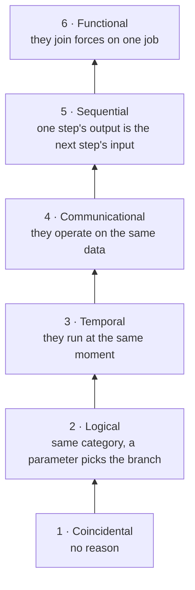
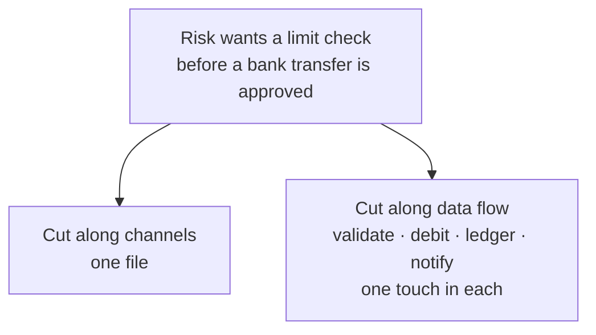

> The second of ten notes in the Programming Thinking series. The case the series is built on is in the [opening essay](/notes/programming-taste-in-the-agent-era/).
>
> AI can write more of our code every month, which makes the judgement we have built up worth more, not less. This series is me taking these ageing principles back off the shelf, checking where each one came from, where it holds, and where it breaks. Reviewing the old to understand the new.

This note is about cohesion: what earns a handful of elements the right to live in the same module. Start with the kind of code nobody defends.

## A utility class nobody defends

```ts
class RefundUtils {
  static formatCurrency(amount: number, currency: string): string { /* formats for display */ }

  static parseWebhookSignature(payload: string, secret: string): boolean { /* verifies the payment channel callback */ }

  static logAuditEvent(event: string, actor: string): void { /* writes the audit log */ }
}
```

**The three methods have nothing to do with one another.** `formatCurrency` serves the presentation layer, `parseWebhookSignature` serves the channel adapters, and `logAuditEvent` serves compliance. They sit together for one reason: whoever wrote them could not decide where else to put them.

Three unrelated jobs end up in one file. Change one and the other two are untouched, and that is precisely the problem. **Anyone who wants the currency formatter also picks up the signature check and the audit logger.**

The fix is not clever. Send each method back where it belongs: `formatCurrency` to the display formatter, `parseWebhookSignature` to the adapter for that channel, `logAuditEvent` to the audit module. After that the name `RefundUtils` should go as well. It was never a description of a responsibility, only a place to put things you had not thought through.

**Cohesion measures how related the elements inside a module are.** Strong relatedness gives the module one reason to exist, which makes it easier to read and less likely to be dragged into changes that have nothing to do with it.

Code like this is rarer in real projects than you might expect, precisely because it is so easy to catch. **The violations that get past review look different.**

## Where the six levels come from

Cohesion and coupling come from "Structured Design", published by Stevens, Myers, and Constantine in the IBM Systems Journal in 1974 [1]. The ideas are older than the paper; Constantine was using them by the mid-1960s.

The paper gives six levels, lowest to highest:

| Level | Name | The reason these are together |
|---|---|---|
| 1 | Coincidental | No reason |
| 2 | Logical | Same category of operation, with a parameter picking the branch |
| 3 | Temporal | They run at the same moment |
| 4 | Communicational | They operate on the same data |
| 5 | Sequential | One step's output is the next step's input |
| 6 | Functional | They join forces on one job |

`RefundUtils` sits at level 1. No reason at all.

Laid out from the bottom up, the levels form a staircase:



Textbooks today usually list seven. Procedural cohesion was added later by Yourdon and Constantine, and Myers proposed two more of his own, so the versions disagree with each other. The count is not what matters. The ordering is: **the table ranks how strong the reason is for these elements to be together**, from no reason at all up to elements that join forces on one job that fails if any of them leaves.

## Logical cohesion: the one that clears review

```ts
type RefundChannel = 'card' | 'wallet' | 'transfer' | 'credit'

class RefundHandler {
  async handle(channel: RefundChannel, req: RefundRequest): Promise<RefundResult> {
    switch (channel) {
      case 'card':     return this.handleCard(req)
      case 'wallet':   return this.handleWallet(req)
      case 'transfer': return this.handleTransfer(req)
      case 'credit':   return this.handleCredit(req)
    }
  }

  private async handleCard(req: RefundRequest)     { /* calls the card network, result arrives by async callback */ }

  private async handleWallet(req: RefundRequest)   { /* updates one balance row, returns synchronously */ }

  private async handleTransfer(req: RefundRequest) { /* issues a payment instruction, waits for manual approval */ }

  private async handleCredit(req: RefundRequest)   { /* issues a voucher, no money moves */ }
}
```

Unlike `RefundUtils`, this class does not look like an accident, and nobody would casually move it. Four methods with nearly identical names, all handling refunds. It looks exactly like code that belongs together.

On the 1974 scale it is logical cohesion, level 2: the four methods are the same category of operation, and one parameter decides which runs. The reasons are in the comments. Cards confirm through an async callback, wallets change a balance and return synchronously, bank transfers wait for a human, and credit compensation moves no money. Failure modes, latency, idempotency, retry rules: **not one of these matches across the four paths.** What they share is the word "refund" and nothing underneath it.

The cost appears when something changes. Risk wants a limit check before a bank transfer is approved. `handleTransfer` has to change, `handle` needs an approval context in its signature, and three branches that had nothing to do with the request get touched anyway.

Walking up the scale means giving each path its own module, each carrying its own timeouts, retries, and idempotency rules, with callers asking for the one that matches their channel. Each module is then at level 6, and adding a limit check touches one file. This has a cost of its own, which shows up the moment you need to add one new operation to every channel at once. The fifth note comes back to this code when it covers the open-closed principle, and by then it will be clear that every direction of the split charges you.

**`RefundUtils` looks wrong at a glance. This class looks right at a glance.** Five levels apart, and a reader's instinct points the wrong way.

## Temporal cohesion: a milder compromise

```ts
async function initRefundContext() {
  await loadChannelConfig()
  await connectLedgerDb()
  warmUpFxRateCache()
  registerMetrics()
}
```

The only thing these four share is that they all run at startup, which puts them at level 3.

This level is gentler than level 2, and in plenty of projects keeping it is the right call. Startup order is a constraint in itself, and having it in one place makes it visible. **The question to ask is whether anyone needs to run one of them on its own.** A test that wants to warm the FX cache without connecting to a database is blocked by this function. If nobody has that need, it can stay exactly as it is.

## Splitting can also break cohesion

```ts
// money.ts
export function add(a: Money, b: Money): Money {
  return { amount: a.amount + b.amount, currency: a.currency }
}

// currency-guard.ts
export function assertSameCurrency(a: Money, b: Money): void {
  if (a.currency !== b.currency) throw new CurrencyMismatchError(a, b)
}
```

Two modules, each with a clear job, and callers just have to remember to assert before they add.

**These two cannot change independently.** Change the currency rule, say by allowing conversion at the quoted rate before adding, and the body of `add` has to follow. Reimplement `add` with decimal precision, and the moment of the check has to move too. Together they do one job: adding two amounts of money safely, level 6. Split apart, the top of the scale turns into two modules that are each clear and fragile in combination, and the fourth invariant from the opening essay, matching currencies, falls out of the type system and becomes an ordering a person has to remember.

Written together:

```ts
export function add(a: Money, b: Money): Money {
  if (a.currency !== b.currency) throw new CurrencyMismatchError(a, b)
  return { amount: a.amount + b.amount, currency: a.currency }
}
```

The top of the scale is elements that join forces on one job, and taking a joint job apart moves you down. So **more files and smaller functions are not a goal that holds without conditions.** A split only counts if the things that always change together are still together once you are done.

## Draw boundaries along the decisions most likely to change

Everything so far grades code that already exists. The harder case is code that does not exist yet: a new requirement in front of you and a line to draw somewhere.

That question had been answered two years before Constantine's paper. In "On the Criteria To Be Used in Decomposing Systems into Modules" [2], published in CACM in 1972, Parnas argues for listing the design decisions that are hardest or most likely to change, then letting each module hide one of them.

He also states the counter-recommendation plainly: **do not decompose along the flow of data**. Cutting along processing steps is most people's first instinct, and it is exactly what his argument is aimed against.

In a refund system, the decision most likely to change is how each channel confirms that the money arrived. Cards rely on an async callback, wallets return synchronously, bank transfers depend on a human, and credit never arrives as money at all. These four change independently: the card network swaps its API, approval gains another tier, the credit rules get adjusted. Nothing connects them. The boundaries go along channels.

Validation, debit, ledger entry, notification: those four steps are data flow. Cut along them and the validation logic for all four channels scatters into the validation module, the debit logic into the debit module, and changing one channel means touching four files. That is the situation Parnas's counter-recommendation describes.

The two cuts differ by a factor of four on the next change:



What the diagram leaves out: cut along data flow and those four touches land in four modules that sit nowhere near each other, so the change has to be reassembled and tested as one anyway.

Parnas names his own cost. Under the implementation assumptions of the time, where a module meant one or a few subroutines, this way of splitting was usually slower. That cost is much smaller now, though it has not disappeared. **Each boundary is one more call and one more data conversion.**

This criterion and the one used for grading land in the same place, approached from opposite directions: one audits code that exists, the other draws lines for code that does not. Both ask the same question: **what changes together?**

## The scale measures reasons, not resemblance

The [opening essay](/notes/programming-taste-in-the-agent-era/) cites a study [3] in which 163 students labelled cohesion and coupling levels for modules in the same mid-sized Fortran program and disagreed with each other at length. That is not a failure of the students. **The scale describes the reason things are together**, and that reason depends on which system the code lives in, who maintains it, and where it is heading next.

I used to think of cohesion as a continuous quantity: higher is better, no steps in between. After reading the 1974 paper I changed that to six ordered levels, and code like `RefundHandler`, whose name similarity is about as high as it gets, lands in the lower half.

I first judged `RefundHandler` by whether its elements looked alike and decided the cohesion was high. Judging again by whether those elements always change together reversed the verdict. One piece of code, two opposite answers. It has made me more careful about treating similar names as evidence of cohesion.

Used as an acceptance criterion, the scale produces a counter-intuitive result: to keep the level looking respectable, people tend to split modules into smaller pieces. The `add` and `assertSameCurrency` example above shows where that leads. Take two functions that join forces on one job and separate them, and the level goes down. **Chasing the level can move you down the scale.** The criterion is not on the table. It is in the system this code lives in, and what changes together is something only that business can answer.

This is also why the 1974 paper is worth going back to. The scale was built as a scorecard for one job: how to cut a Fortran program into modules. Every level sits behind a specific decision about a specific split. Once it was lifted out into the slogan "higher cohesion is better", the trouble it was built for left the room, and splitting further looked right by default, right up to the point where `add` and the currency check came apart and the level fell anyway. **The spirit of a principle is the trouble it was written for. You read that trouble off the business, not off the table.**

## What this note concludes

- **Cohesion measures how strong the reason is for things to be together, not how much they look alike.** `RefundHandler`'s four methods could not look more alike, and on the 1974 scale they land at level 2.
- **The test is whether these things always change together.** Whether one change drags the others along is something you can check on the spot. Resemblance is not.
- **The six levels are an ordered staircase, not a continuous dial where higher is better.** Level 6, joining forces on one job, is the top, and splitting moves you down: separate `add` from the currency check and each module is clear while the combination turns fragile.
- **Splitting is not a goal that holds without conditions.** A split only counts if the things that always change together are still together once you are done.
- **Draw boundaries along the decisions most likely to change, not along the flow of data.** Parnas wrote that counter-recommendation in 1972: cutting along processing steps is most people's first instinct.
- **The scale is a judgement scale, not an acceptance criterion.** 163 people can read the same code and land on different levels, because the answer depends on where the system is heading. Chasing the level can move you down the scale.
- **Read the trouble off the system, not off the table.** The 1974 scale was a scorecard for cutting one Fortran program into modules. What changes together in your code is a fact about your business, and the table cannot answer for it.

The next note is about coupling, in the same refund system.

## References

1. [W. P. Stevens, G. J. Myers, L. L. Constantine, "Structured Design", IBM Systems Journal 13(2), 1974, 115–139](https://dl.acm.org/doi/10.1147/sj.132.0115)
2. [D. L. Parnas, "On the Criteria To Be Used in Decomposing Systems into Modules", Communications of the ACM 15(12), 1972, 1053–1058](https://dl.acm.org/doi/10.1145/361598.361623) ([full text PDF](https://wstomv.win.tue.nl/edu/2ip30/references/criteria_for_modularization.pdf))
3. [Difficulties using cohesion and coupling as quality indicators, Software Quality Journal](https://link.springer.com/article/10.1007/BF00590439)
