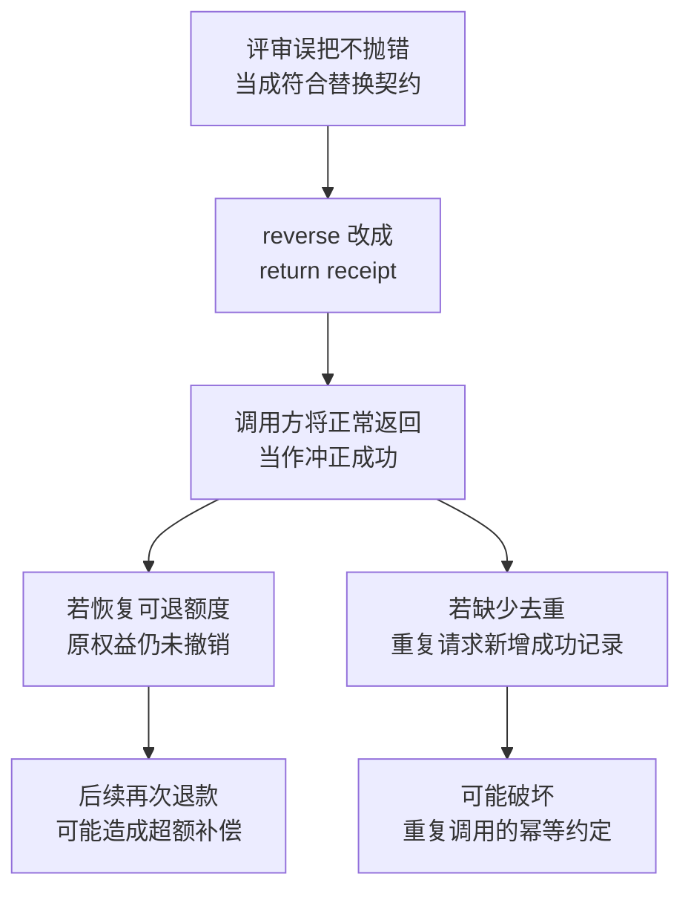
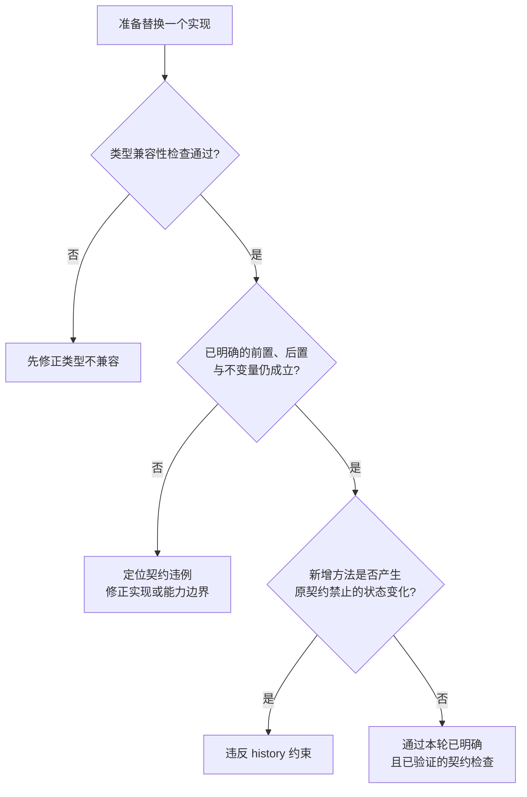

> 《编程思想》系列第 6/10 篇。这一季的立论在[序章](/zh/notes/programming-taste-in-the-agent-era/)。
>
> AI 能替我们写的代码越来越多，程序员自己攒下的经验和底层判断因此更值钱。这个系列是我把这些上了年纪的原则重新翻出来，一条条查它们的出处、边界和失效场景的记录。温故而知新。

[第 5 篇](/zh/notes/open-closed-only-the-guessed-axis/)讨论了一套按渠道拆分的退款系统：银行卡、钱包、线下转账和积分补偿分别由不同模块处理。积分补偿发放的是权益，不直接转出资金；退款冲正则需要撤销原操作的效果，并保留可追溯的反向记录。

那篇文章分析过一种有问题的设计：在所有渠道共用的 `RefundChannel` 接口上增加 `reverse`，即使某个渠道不支持冲正，也要求它实现这个方法。本篇回到这个方案，检查它为什么在类型上成立，却可能无法满足调用方的预期。

退款冲正功能上线后的第三个星期，财务人员在后台对一笔积分补偿执行冲正。页面等待了两秒，随后显示 `UnsupportedOperationError`。调用方使用的是下面这段代码；这里假定渠道已注册，重点观察最后一行如何调用 `reverse`。

```ts
async function reverseRefund(r: Refund, reason: string): Promise<ChannelReceipt> {
  const channel = channels.get(r.channel)!
  return channel.reverse(r.receipt, reason)
}
```

`reverse` 已经在接口中声明，返回类型也是 `Promise<ChannelReceipt>`，所以这次调用能通过类型检查。单元测试只覆盖了银行卡和钱包，没有执行积分补偿路径；评审也没有识别出公共接口与渠道能力之间的缺口。三项检查遗漏问题的原因不同，不能把它们都理解成签名检查。

**里氏替换关注的是：换入另一个实现之后，调用方依据原契约作出的判断是否仍然成立。** 方法存在、参数可以传入，只说明调用在类型层面兼容。调用之后会发生什么，还需要检查行为契约。

## 替换的是实现，保留的是调用方的合理预期

Barbara Liskov 在 1987 年的 OOPSLA 主题演讲《Data Abstraction and Hierarchy》中提出了替换性质。我下载原文读过，其中第 3.3 节从“使用这个类型的程序”出发讨论替换。该段位于印刷页第 25 页。[1]

用原文的符号表示：对于类型 S 的每个对象 o1，如果都能找到超类型 T 的一个对象 o2，使所有按 T 定义的程序在用 o1 替换 o2 后保持相应行为，那么 S 可以作为 T 的子类型。替换方向是用 S 的对象替换 T 的对象。

落实到工程设计时，需要先明确调用方能够依赖 T 的哪些承诺。不同实现可以使用不同的数据结构、外部服务和内部算法，只要这些差异不破坏契约允许调用方依赖的行为。

Liskov 在同一节区分了行为上的子类型关系与语言提供的子类关系。继承可以用来实现子类型，但一个类写了 `extends`，并不足以说明它在行为上可替换；通过接口实现多态，也同样需要这项检查。[1]

她用集合、列表、栈和队列说明问题。集合通常不保留重复元素，列表可以保留；栈按后进先出的顺序取元素，队列按先进先出的顺序取元素。如果调用方依赖这些特定规则，就不能仅凭同名的添加、移除方法把它们互换。

Martin 在 1996 年的文章中，也从客户端所依赖的公开行为讨论替换，并说明了前置条件与后置条件的要求。[4] 因此，将里氏替换缩减为“方法签名相同”会丢掉这些原有内容。

## 用四类契约描述行为

替换性质给出了判断方向。为了检查一段实际代码，还需要将“行为相容”展开为具体约束。Meyer 的契约式设计，以及 Liskov 与 Jeannette Wing 对行为子类型的形式化研究，为这种检查提供了依据。[2][3][5]

下面保留四类约束，并用工程语言概括它们的含义。它们相互关联；同一个错误可能同时破坏方法的后置条件和对象的不变量。

| 条款 | 内容 | 归属 |
|---|---|---|
| 前置条件 | 原契约接受的输入，替换实现也应接受，不能额外增加门槛 | 契约式设计与行为子类型中的方法规则 |
| 后置条件 | 在满足原前置条件的调用中，替换实现应兑现原有结果保证 | 契约式设计与行为子类型中的方法规则 |
| 不变量 | 替换实现应保持超类型对可观察状态的约束 | 契约式设计；Liskov 与 Wing 的形式化研究 |
| history 约束 | 新增操作也应保持超类型承诺的历史性质，不引入其禁止的状态变化 | Liskov 与 Wing 对行为子类型的研究，见 1994 年论文及其先行报告 |

history 约束需要放到“别名”背景下理解：两个变量可以引用同一个对象，一个变量按超类型使用它，另一个变量可以访问实现额外提供的方法。后者改变的状态，可能被前者观察到。JavaScript 和 TypeScript 中，这种共享引用很常见。[2][3]

例如，某个接口承诺事件历史只能追加。如果实现增加了删除历史事件的方法，另一处只使用原接口的代码也会看到事件消失。这里需要检查的是承诺是否被破坏；原契约允许的状态修改仍然可以进行。

## 四类约束在退款系统中的表现

以下片段分别展示可能的违约方式，省略了与说明无关的导入和成员。示例中的 `Money` 用整数分表示人民币金额，因此 `10000` 表示 100 元，50 元表示 `5000`。金额的有效性仍需要业务校验。

### 返回的结算状态与时间是否一致

先看提交退款后返回的回执。下面的接口允许两个字段分别取值，却没有表达它们之间的关系：

```ts
type Money = number

interface ChannelReceipt {
  id: string
  status: 'settled' | 'pending'
  settledAt: Date | null
  amount: Money
}
```

本例的回执契约规定：已结算回执必须有结算时间，待处理回执的结算时间为 `null`。线下转账生成付款指令后还要等待人工审批，如果这时返回下面的对象，就提前报告了结算成功：

```ts
async submit(req: RefundRequest): Promise<ChannelReceipt> {
  const instruction = await this.createInstruction(req)
  return { id: instruction.id, status: 'settled', settledAt: null, amount: req.amount }
}
```

`status` 表示已经结算，`settledAt` 却没有值。两个字段单独看都符合类型定义，组合起来却违反了回执契约。依赖这份契约的调用方可能这样写：

```ts
const receipt = await channel.submit(req)
if (receipt.status === 'settled') await ledger.settle(refund.id, receipt.settledAt!)
```

那个 `!` 是我自己加的，因为原类型允许 `settledAt` 为 `null`。非空断言会取消这一处类型警告，但不会在运行时补上日期或拒绝空值，因此账本函数仍可能收到 `null`。

后续结果取决于账本函数的实现：它可能校验失败，也可能错误地记录结算。仅凭这段代码不能断言一定超退；能够确认的是，渠道没有兑现提交后的回执保证，调用方依据结算状态作出的推理已经失去可靠依据。

### 实现是否增加了契约之外的输入门槛

假定提交接口的契约接受所有通过其他校验的正金额请求。线下转账因为需要人工审批，低金额原本要走另一条处理流程，实现却直接增加了 100 元的最低金额限制：

```ts
async submit(req: RefundRequest): Promise<ChannelReceipt> {
  if (req.amount < 10000) throw new BelowApprovalThresholdError(req.amount)
  // 其余提交逻辑省略
}
```

一笔符合原契约的 50 元请求，在这里会被拒绝。问题来自实现额外收窄了接受范围。如果最低金额本来就在该接口的前置条件中，这次拒绝则可能符合契约。

普通的 `number` 类型不会描述这项业务门槛。检查方法名和参数类型，也无法发现调用方与实现对合法金额的理解不同。

### 渠道是否保持了订单的退款额度约束

退款系统还需要保证累计退款额不超过原订单实付额。对于一次新提交，这意味着请求金额不能超过提交时可用的剩余退款额度；并发请求也需要共享一致的额度检查与占用机制。

礼品卡实现如果省去本系统的订单额度检查，只相信“网关会挡住不合法的交易”，就留下了缺口。即使网关验证了自己的账户规则，也不能据此假定它知道这张订单在其他渠道已经退过多少。

只有在公共流程或渠道实现中存在可靠的统一检查，这个约束才有保障。若检查确实缺失，调用方就不能继续假定换入礼品卡实现后仍会遵守同一退款上限。这里讨论的是跨请求的业务状态约束，无法仅靠回执字段的类型证明。

### 新增方法是否破坏了历史约定

本例还约定退款阶段记录只能追加。冲正通过新的反向记录表达，原来的结算记录仍需保留。银行卡异步回调可能乱序，因此实现增加了一个删除末尾阶段的补救方法。下面只摘出这个新增方法，其余已有成员省略：

```ts
class CardChannel implements RefundChannel {
  // 接口上没有这个方法
  rollbackLastStage(refund: Refund): void {
    refund.stages.pop()
  }
}
```

假定渠道内部保存了这笔 `refund` 的引用，`stagesOf` 会从同一份记录读取阶段历史。两个变量引用同一个渠道对象时，就可能出现下面的情况：

```ts
const card = new CardChannel(/* … */)
const asChannel: RefundChannel = card   // 同一个对象，两个类型视角

card.rollbackLastStage(refund)
asChannel.stagesOf(refund.id)           // 读到删除末尾阶段后的历史
```

`card` 可以调用实现额外提供的方法，`asChannel` 只能使用公共接口，但它们操作的是同一对象及其关联状态。删除发生后，通过公共接口读取历史的代码也会看到阶段减少。

这破坏了“历史只能追加”的约定。判断依据是可观察历史是否仍符合契约，不能把它简化为“新增方法一旦修改状态就违规”。同样，给不可变点增加可以改变坐标的方法，会破坏原有的不可变承诺；对允许修改坐标的类型，则需要依据另一份契约判断。[2][3]

## 编译器能检查什么

上面的业务约束有些可以进入类型，有些需要运行时校验、测试或其他验证方法。代码片段中的业务错误并不意味着编译器完全无法帮助我们。

我原本以为开启 `strict` 已经足以拦住参数接受范围收窄的问题。对方法语法和函数属性语法做了比较后，发现它们有一个需要单独注意的区别。下面使用 TypeScript 7.0.2、`strict: true` 验证；补全回执字段，是为了让编译结果只反映参数兼容性。

```ts
interface RefundRequest {
  amount: Money
}

interface TransferRefundRequest extends RefundRequest {
  bankAccount: string
}

interface RefundChannel {
  submit(req: RefundRequest): Promise<ChannelReceipt>
}

class TransferChannel implements RefundChannel {
  async submit(req: TransferRefundRequest): Promise<ChannelReceipt> {
    return {
      id: req.bankAccount,
      status: 'pending',
      settledAt: null,
      amount: req.amount,
    }
  }
}
```

`TransferRefundRequest` 比公共请求多要求一个 `bankAccount` 字段，原本只带金额的请求无法满足它，但上述方法实现仍能通过检查。把接口成员改为函数属性后，同样的参数收窄会被拒绝：

```ts
interface RefundChannelFn {
  submit: (req: RefundRequest) => Promise<ChannelReceipt>
}

const transfer: RefundChannelFn = {
  async submit(req: TransferRefundRequest): Promise<ChannelReceipt> {
    return {
      id: req.bankAccount,
      status: 'pending',
      settledAt: null,
      amount: req.amount,
    }
  },
}
// TS2322: 参数类型不兼容
```

TypeScript 的发布说明将这个差异描述为方法和构造器声明在严格函数参数检查中的例外，并说明其与泛型容器兼容性的关系。[6] 它限定了这项静态检查的能力，不代表所有参数错误都会被放过。

更广泛的行为兼容性也不能交给一个通用检查器完整判定。例如，要求通用工具判断任意方法是否必然终止，就会碰到不可判定性问题。[7] 但具体字段关系、部分输入约束、选定操作序列，都可以通过类型或自动化检查获得保障。讨论工具能力时，需要说明它证明了哪一部分，哪些仍未覆盖。

## 为什么原样返回回执可能更危险

回到积分补偿冲正失败的场景。评审会上提出的修正办法是：既然抛 `UnsupportedOperationError` 不符合调用方预期，就改成返回原样的回执，因为积分补偿不直接产生资金流动。

```ts
class CreditChannel implements RefundChannel {
  async reverse(receipt: ChannelReceipt): Promise<ChannelReceipt> {
    return receipt
  }
}
```

这段代码没有撤销任何权益，也没有创建反向记录。它只是让方法正常返回。若调用方把正常返回当作冲正成功，并据此更新额度或记账，就可能将原本可见的失败变成难以察觉的数据错误。

下图保留了两条风险路径。每条路径都需要相应的调用方行为或校验缺失才会发生，不能只由 `return receipt` 推出全部结果。



第一条路径中，调用方恢复了可退额度，而用户仍持有原有权益；如果后续再次退款，就可能造成超过订单应有范围的补偿。第二条路径还要求冲正记录没有按同一请求去重，重复调用才会新增多条成功记录。额度与幂等检查本来都应当阻断这些风险。

因此，修正方案需要兑现冲正的实际语义。一个明确允许返回“不支持”的契约，可以合法地拒绝某些操作；如果契约承诺所有符合条件的请求都能执行冲正，实现却一律拒绝，就破坏了这份承诺。原样返回回执同样无法代替真正的成功。

Martin 在讨论矩形与正方形时，强调模型是否有效要放到客户端的使用方式中判断。[4] 对退款调用方来说，需要的是可信的冲正结果。若它必须为某个“同类型”实现添加特殊补丁才能继续工作，原本希望通过开闭原则获得的稳定性也会受到影响。

## 把可以检查的契约落到实现中

### 用类型表达回执状态之间的关系

前面的 `ChannelReceipt` 可以改成可辨识联合，让已结算和待处理回执分别拥有合适的字段：

```ts
type ChannelReceipt =
  | { status: 'settled'; id: string; settledAt: Date; amount: Money }
  | { status: 'pending'; id: string; amount: Money }
```

在严格类型检查下，按这个定义构造“已结算但结算时间为 `null`”的对象会报错。调用方判断 `status === 'settled'` 后，也可以直接获得 `Date` 类型的 `settledAt`，无需使用非空断言。

这是对前一版回执结构的修订。调用方读取待处理回执时，需要按状态分支访问字段。外部输入仍需运行时验证；`any`、不安全的类型断言或未校验的外部数据，都可能绕开静态保证。

### 用能力接口表达哪些渠道提供冲正

在这个例子中，我会保留只要求提交能力的公共接口，再让支持冲正的渠道实现单独的能力接口。下面的注册表只列出已实现冲正的渠道：

```ts
interface RefundChannel {
  readonly kind: ChannelKind
  submit(req: RefundRequest): Promise<ChannelReceipt>
}

interface ReversibleChannel extends RefundChannel {
  reverse(receipt: ChannelReceipt, reason: string): Promise<ChannelReceipt>
}

const reversible = new Map<ChannelKind, ReversibleChannel>([
  ['card', new CardChannel(cardGateway)],
  ['wallet', new WalletChannel(ledger)],
])
```

冲正入口集中查询能力，不要求每个调用方分别判断。动态查表仍可能找不到实现，所以这段类型声明不会消除运行时检查；业务上明确不支持与本应支持却漏了配置，也需要区分。

这与第 5 篇的方案一致：先确认渠道应当具备哪些能力，再连接对应实现。能力接口只约束了成员与类型，真正的冲正行为仍需实现和验证。若产品要求积分补偿也支持冲正，就需要完成权益撤销等业务能力，或明确调整需求范围，不能仅靠把它移出注册表完成需求。

### 让不同实现运行同一组契约检查

类型暂时表达不了的规则，需要写在接口旁边，并落实到实现校验与测试中。现有调用方的合理依赖可能已经构成隐含契约；将它写出来，是为了让维护者能够一致核对。

各渠道应使用同一份契约检查要求，按各自能力准备输入和环境。例如：符合公共金额条件的请求是否会被额外拒绝；成功回执是否符合状态约定；额度检查能否阻止超退；同一冲正请求重复执行是否符合幂等约定；实现额外提供的方法是否会删除承诺保留的历史。

这些检查需要包含原先漏测的积分补偿和线下转账路径。明确不支持冲正的渠道验证其拒绝行为，承诺支持的渠道验证实际撤销效果与反向记录。通过这些测试只能说明已覆盖的场景符合预期，不能据此证明所有输入和操作序列都满足里氏替换。

## 检查一个实现是否适合替换

评审一个新的渠道实现时，我会先找到调用方依赖的契约，再沿下面几个问题检查。契约尚不明确时，需要先厘清已有调用方与业务需求，不能把“没有写下来”理解成“没有任何承诺”。

- 原契约接受哪些输入？实现是否额外要求了金额门槛、字段或调用顺序？
- 满足前置条件后，调用方可以依赖哪些结果？实现是否兑现了结算状态、时间和金额的约定？
- 对象或业务系统有哪些必须保持的状态约束？通过其他渠道或并发请求，是否可能绕过它们？
- 实现新增了哪些操作？这些操作是否会产生原契约禁止的可观察状态变化？

图中的三个判断依次关注类型兼容性、已明确的状态与方法契约、历史约束：



这张图用于组织评审，不是能自动证明所有行为的判定算法。图中每个“通过”都应有对应的契约和验证依据；尚未验证的部分应当保留为限制。

## 我改了什么判断

我以前把里氏替换当成关于继承的规矩，检查子类有没有改掉父类的方法语义，接口旁边却没有留下明确的约定。读过原文之后，我会先看调用方依据这个类型作出了什么判断，再检查另一个实现能否维持这些判断。

对于本文的退款系统，这意味着把回执状态关系写进类型，把冲正能力与普通提交能力分开，并为各个实现运行同一组契约检查。遇到不支持的业务操作时，需要明确表达限制；遇到承诺支持却没有完成的操作时，需要修复实现。让方法“不再报错”无法独自回答这两个问题。

下一篇讨论依赖倒置。这里先留下一个具体问题：`ReversibleChannel` 应当由谁定义，才能准确表达调用方需要的能力，而不是把某个渠道当前的实现细节变成所有调用方都要接受的约束？

## 参考资料

1. [Barbara Liskov, “Keynote address — Data Abstraction and Hierarchy”, OOPSLA '87 Addendum, ACM SIGPLAN Notices 23(5), 1988, 17–34](https://www.cs.tufts.edu/~nr/cs257/archive/barbara-liskov/data-abstraction-and-hierarchy.pdf) —— 替换性质 [S] 位于第 3.3 节、印刷页第 25 页（PDF 第 9 页）；该节区分行为子类型与语言中的子类，并讨论允许异常的规范。
2. [Barbara Liskov, Jeannette Wing, “A Behavioral Notion of Subtyping”, ACM TOPLAS 16(6), 1994, 1811–1841](https://dl.acm.org/doi/10.1145/197320.197383) —— 方法规则、不变量和历史约束；可读取 [作者所在学校保存的 PDF](https://www.cs.cmu.edu/~wing/publications/LiskovWing94.pdf)。相关工作有先行技术报告，不将所有规则的出现时间简化为 1994 年。
3. [Gary T. Leavens, Krishna K. Dhara, “Concepts of Behavioral Subtyping”, in *Foundations of Component-Based Systems*, Cambridge University Press, 2000](https://www.eecs.ucf.edu/~leavens/FoCBS-book/06-leavens-dhara.pdf) —— 比较行为子类型定义及对别名、可变状态的处理。
4. [Robert C. Martin, “The Liskov Substitution Principle”, *C++ Report*, March 1996](https://objectmentor.com/resources/articles/lsp.pdf) —— 从客户端解释模型的有效性，并讨论前置、后置条件以及 LSP 与 OCP 的联系。
5. [Bertrand Meyer, *Object-Oriented Software Construction*, Prentice Hall, 1988](https://dl.acm.org/doi/book/10.5555/534431) —— 契约式设计的历史出处；本次未直接核对原书，各规则的本文表述参照上述论文与综述。
6. [TypeScript 2.6 发布说明：strict function types](https://www.typescriptlang.org/docs/handbook/release-notes/typescript-2-6.html) —— 方法与构造器声明的检查例外。本文代码另在 TypeScript 7.0.2 下验证。
7. [Liskov substitution principle — Wikipedia](https://en.wikipedia.org/wiki/Liskov_substitution_principle) —— 一般不可判定性及终止性例子的辅助说明，不作为历史来源或“无法自动检查任何契约”的依据。
