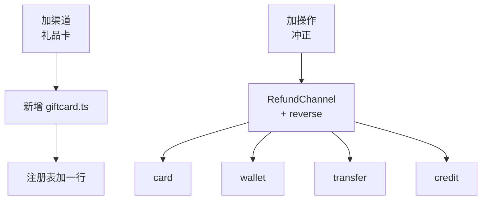
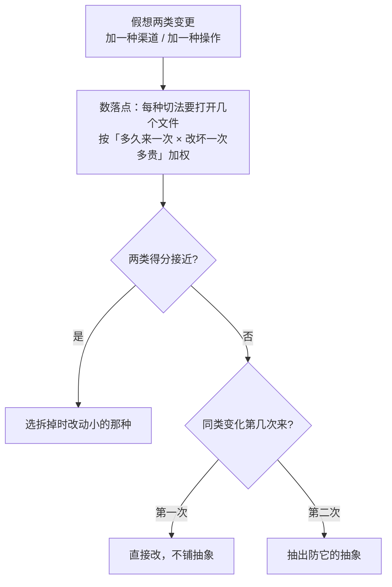

> 《编程思想》系列第 5/10 篇。这一季的立论在[序章](/zh/notes/programming-taste-in-the-agent-era/)。
>
> AI 能替我们写的代码越来越多，程序员自己攒下的经验和底层判断因此更值钱。这个系列是我把这些上了年纪的原则重新翻出来，一条条查它们的出处、边界和失效场景的记录。温故而知新。

[第 2 篇](/zh/notes/what-belongs-in-one-module/)里那个 `RefundHandler` 最后按渠道拆成了四个模块，各自带着自己的超时、重试和幂等策略。拆完三个月，来了两件事。

第一件是加渠道：礼品卡。新建一个文件，实现一个接口，在注册表里加一行，提交流程一行没动。半天收工，测试都写完了。

第二件是加操作：冲正。财务要求已结算的退款能撤销，撤销按序章第三条不变量走反向记录。这个改动最后动了五个文件：接口一个，四个渠道实现各一个，积分补偿那份的方法体里只有一句 `throw`。

同一份设计，往一个方向加文件，往另一个方向改所有文件。**不是拆错了，是那次拆分只对其中一条轴开放。**开闭原则难的地方就在这儿。

## 加渠道的那半天

拆完之后的样子：

```ts
interface RefundChannel {
  readonly kind: ChannelKind
  submit(req: RefundRequest): Promise<ChannelReceipt>
}

const channels = new Map<ChannelKind, RefundChannel>([
  ['card', new CardChannel(cardGateway)],
  ['wallet', new WalletChannel(ledger)],
  ['transfer', new TransferChannel(approvalFlow)],
  ['credit', new CreditChannel(couponStore)],
])

async function submitRefund(req: RefundRequest): Promise<ChannelReceipt> {
  const channel = channels.get(req.channel)
  if (!channel) throw new UnknownChannelError(req.channel)
  return channel.submit(req)
}
```

加礼品卡要做的事只有这些：

```ts
class GiftCardChannel implements RefundChannel {
  readonly kind = 'giftcard' as const
  constructor(private gateway: GiftCardGateway) {}

  async submit(req: RefundRequest): Promise<ChannelReceipt> {
    // 核销回原卡，余额不足整笔失败
  }
}
```

`ChannelKind` 里加一个字面量，`channels` 里加一行。原来那四个文件一个都没打开。

这就是 Meyer 1988 年那句话描述的场面：**新需求靠加代码完成，已经写好并且在跑的东西不动。**

## 冲正要打开五个文件

```ts
interface RefundChannel {
  readonly kind: ChannelKind
  submit(req: RefundRequest): Promise<ChannelReceipt>
  reverse(receipt: ChannelReceipt, reason: string): Promise<ChannelReceipt>
}
```

四个实现各补一个方法。积分补偿那一份：

```ts
class CreditChannel implements RefundChannel {
  async reverse(): Promise<ChannelReceipt> {
    throw new UnsupportedOperationError('credit')
  }
}
```

麻烦落在三处。接口上多了一个并非所有实现都支持的方法；调用方得自己判断哪些渠道能冲正；最实际的一处是，这次改动要打开五个文件，其中四个已经上线、跑着真实资金。

两次改动的落点摊开放在一起看：



左边那条链上全是新增的东西，右边除了接口，另外四个文件都要打开，`credit.ts` 打开只为写一句 `throw`。

同样是「加一种东西」，一次加一个文件，一次改五个。**这次变化撞在了设计的背面，跟代码写得好不好没关系。**

一个很自然的反问是：那再抽一个 `ReversibleChannel` 接口，让能冲正的两个渠道各自实现它，积分补偿和线下转账不实现，不就不用改五个文件了？确实能少改，五个降到三个。代价跟着来了：调用方要先按能力判断这笔记账能不能冲正，这个判断会散到各处；下一个新操作来的时候，同样的动作还要再做一遍。**抽接口解决的是这一次，没有解决这一类。**

## 两代机制都在回答怎么扩展

序章查过这条原则的来历。Meyer 1988 年在《Object-Oriented Software Construction》里写下这句话，机制是继承具体类：类已经编译进库、被别的类用着，新类拿它当父类加特性，原类和它的客户都不用动[1]。1996 年 1 月，Martin 在 C++ Report 上重写了一遍，机制换成抽象接口加多态，客户端依赖抽象，新行为靠新实现替换进来[2]。

**两版对「怎么扩展」的回答不一样，对「往哪个方向扩展」都没回答。**序章留过一个尾巴，说这两种扩展点失效的样子要分两篇讲，这里先把 Meyer 那份交掉：扩展点落在继承层级上时，子类通过继承拿到父类的内部假设，父类一改，子类跟着坏，而父类这边通常不知道自己有哪些子类。这条线第 10 篇讲合成复用时会回来。

Martin 那份留到下一篇。但 Martin 那一篇里还有一句，那句才是这条原则能用的部分。

## 封闭只能是战略性的

> It should be clear that no significant program can be 100% closed. … Therefore, closure cannot be complete; it must be strategic. That is, the designer must choose the kinds of changes against which to close his design. This takes a certain amount of prescience derived from experience.[3]

译过来是：没有哪个有意义的程序能做到百分百封闭，所以封闭只能是战略性的，设计者必须挑出要挡住哪一类变化；挑这件事需要一点预见，预见来自经验。

**这句把开闭原则从验收标准降成了赌注。**押对了，新需求就是加一个文件；押错了，那份抽象会变成下一次改动要绕开的障碍。

关于这句引文：objectmentor.com 上的原文 PDF 和它的存档快照现在都取不到，我拿到的是几处互相一致的二手转述，措辞按转述处理。

## 行和列只能选一边

1998 年 11 月，Philip Wadler 在 java-genericity 邮件列表上发了封邮件，标题是《The Expression Problem》。他把这个问题讲成一张表：

> One can think of cases as rows and functions as columns in a table. In a functional language, the rows are fixed (cases in a datatype declaration) but it is easy to add new columns (functions). In an object-oriented language, the columns are fixed (methods in a class declaration) but it is easy to add new rows (subclasses).[4]

退款系统里，**渠道是行，操作是列**。前面按渠道切，加行（新渠道）只加一个文件，加列（新操作）要补满所有行。

换成按列切试试。把渠道写成可辨识联合，操作各自一个文件：

```ts
type Refund =
  | { kind: 'card'; receiptId: string; settledAt: Date }
  | { kind: 'wallet'; entryId: string }
  | { kind: 'transfer'; instructionId: string; approved: boolean }
  | { kind: 'credit'; couponId: string }

// reverse.ts
export function reverse(r: Refund): Refund {
  switch (r.kind) {
    case 'card':
      return { kind: 'card', receiptId: r.receiptId, settledAt: new Date() }
    case 'wallet':
      return { kind: 'wallet', entryId: r.entryId }
    case 'transfer':
    case 'credit':
      throw new UnsupportedOperationError(r.kind)
  }
}
```

加冲正现在只新建一个文件。加礼品卡要打开每一个操作文件，给每个 `switch` 补一条分支。**代价翻到了另一面。**

换一种切法，那个 N 就挪到另一格去：

| 切法 | 加一种渠道（新行） | 加一种操作（新列） |
| --- | --- | --- |
| 按渠道切，每个渠道一个类 | 新增 1 个文件 | 改 N 个渠道类 |
| 按操作切，每个操作一个函数 | 改 N 个操作文件 | 新增 1 个文件 |

对角线上那个「1」和另一半那个「N」是同一件事的两面。**选哪条轴，就是挑哪一格的 N 更常来、改坏一次更贵。**

这里有个前提：上面那个 `switch` 故意没写 `default: throw`。加了新渠道之后它不再穷尽，函数返回类型对不上，TypeScript 会在每一个漏掉的操作文件里报错。要是图省事加了兜底分支，编译期就安静了，问题留到线上。**穷尽检查不是白拿的，它要求分支写全，而不是兜住。**

顺带说一个我原本以为存在、写着写着发现不成立的差别。我原以为这是联合类型这版独有的好处，多态那版没有。核对之后发现两边都有，给接口加方法，没实现的类一样编译不过。编译器能报的一样多，不一样的是漏的东西：多态版漏的是「某个渠道还没实现这个新操作」，联合版漏的是「某个操作还没处理这个新渠道」。**选哪条轴，等于选以后更愿意被点名的是哪一种遗漏。**

第 2 篇引过 Parnas 1972 年那条判据：沿最可能变化的决策划边界。这里要补的一步是，**先数清楚有几条轴，再决定哪一条算最可能。**

## switch 到底违不违反

第 2 篇那个 `RefundHandler` 里的 `switch` 确实有问题，但当时给出的理由是逻辑内聚：四个分支的失败模式和幂等做法没有一条相同。判据在别的地方，跟写法无关。

判据是这类分支一共有几份，加一种情况要打开几个文件。**一个集中的 `switch` 加一条分支改一处；四个类各加一个方法改五处。**编译器在两边都帮得上忙，帮不了的是落点数。

所以「见到 switch 就判违反开闭」这个说法太粗。**它把写法当成了判据，写法其实只是落点数的一种后果。**

## 「不修改」当不了验收标准

把开闭读成「永远不改老代码」，执行起来就是给每个接缝先铺一层接口。代价有两笔：抽象本身是一条依赖，这一点第 3 篇算过；没人用过的扩展点会占住位置，等真正需要的那种变化来的时候，它反而是挡路的那一个。

**这两笔代价加起来，恰好是这条原则想避免的反面：代码比不套原则时更难改。**铺出去的抽象没有挡住任何一次真实变化，只是让下一次变化多绕一层。序章里那句「照搬原则会写出反原则的代码」，在这一条上最容易验证——因为铺接口的动作本身看着就合规。

Martin 给过一个能用的时机判据，出处是《Agile Software Development》：

> There is an old saying: "Fool me once, shame on you. Fool me twice, shame on me." … we initially write our code expecting it not to change. When a change occurs, we implement the abstractions that protect us from future changes of that kind. In short, we take the first bullet, and then we make sure we are protected from any more bullets coming from that gun.[5]

第一次遇到这类变化，直接改。第二次同类变化再来，才把防它的抽象抽出来。**这条把「要不要铺抽象」从审美问题变成了计数问题：数到二。**

## 猜错之后还在往上加

**抽象不是单向门。**文件边界清楚的时候，把接口拆掉、把分支收回来，通常比当初铺开它便宜。真正贵的只有一种情况：已经有别人依赖了这个扩展点，拆它要连调用方一起动。

拆不拆得动，在选切法的时候就看得见。接口有几个调用方、这些调用方是同组维护还是别的团队在用，决定了押错之后退不退得回来。

## 一个能当场算的判据

- **数落点。** 把两类变更各假想一遍（加一种渠道、加一种操作），数清楚每种切法下要打开几个文件。比数字，不比哪个更优雅。
- **排风险。** 按「多久来一次 × 改坏一次的代价」排。冲正涉及资金，四个已上线的渠道实现同时被打开，比新增一个新渠道文件贵得多。退款系统里，操作是主变化轴。
- **抽象落在第二枪。** 第一次遇到就直改，第二次同类再来才抽。
- **留退路。** 落点数接近时，优先选拆掉时改动小的那种切法。

前两条决定怎么切，后两条决定什么时候切以及切错了怎么办。四条不是并列的一张清单，走一遍有先后：



分叉点只有两个：落点数接近时看退出成本，不接近时看这类变化来过几次。

## 这篇的结论

- **开闭不是一个能达成的状态，是一次押注。**没有哪个有意义的程序能做到百分百封闭，设计者只能挑出要挡住哪一类变化。挑这件事需要预见，预见来自经验。
- **同一个设计对一条轴开放，就对另一条封闭。**退款系统里渠道是行、操作是列，两种切法各让一个方向变成「新增一个文件」，另一方向变成「改 N 个文件」。
- **判据是数落点，不是看写法。**集中 `switch` 加一条分支改一处，给四个类各加一个方法改五处。
- **「见到 switch 就判违反开闭」这个说法太粗。**写法是落点数的后果，不是判据本身。
- **抽象落在第二枪。**第一次遇到这类变化直接改，第二次同类再来才抽——这把「要不要铺抽象」从审美问题变成了计数问题。
- **抽象不是单向门。**边界清楚的时候拆掉它，通常比当初铺开它便宜；押错了还继续往上加，才会把一次误判变成长期成本。
- **把「不修改」当验收标准，产出的是这条原则的反面。**铺出去的接口没挡住任何真实变化，只是让下一次变化多绕一层。

## 我改了什么判断

我以前把开闭当验收标准：改动老代码就是设计失败，于是每个接缝先铺一层接口，铺完自己都说不清那些接口挡的是哪类变化。

现在的判据换成一句：**这次变化要打开几个文件**。数字大，说明变化落在了背面，要么换个切法，要么承认这次就该改。押错了不丢人，边界清楚的时候拆掉它比当初铺开它便宜；押错了还继续往上加，才会把一次误判变成长期成本。

下一篇讲里氏替换。Martin 版开闭靠多态实现，而**「新实现能不能真的换掉旧实现」这件事，开闭原则自己不检查。**上面那个只会抛错的 `CreditChannel.reverse`，签名完全合法。

## 参考资料

1. [Bertrand Meyer, *Object-Oriented Software Construction*, Prentice Hall, 1988](https://dl.acm.org/doi/book/10.5555/534431) ——「open/closed」的原始定义在第 23 页，继承那段机制在第 229 页；页数和引文经 [Wikipedia 的 OCP 条目](https://en.wikipedia.org/wiki/Open%E2%80%93closed_principle)核对，原书未取到。
2. [Robert C. Martin, "The Open-Closed Principle", *C++ Report*, January 1996](https://en.wikipedia.org/wiki/Open%E2%80%93closed_principle) —— 年份与刊物同上核对；原文 PDF（objectmentor.com）已下线。
3. 同 2 中关于 "no significant program can be 100% closed" 与 "closure … must be strategic" 的段落 —— 二手转述见 [Software Engineering Stack Exchange 上的完整引录](https://softwareengineering.stackexchange.com/a/406376)与 [enjoyalgorithms 的转载](https://enjoyalgorithms.com/blog/open-close-principle)。
4. [Philip Wadler, "The Expression Problem", java-genericity 邮件列表，1998-11-12](https://homepages.inf.ed.ac.uk/wadler/papers/expression/expression.txt) —— 行与列那段比喻出自这封邮件开头。
5. [Robert C. Martin, *Agile Software Development, Principles, Patterns, and Practices*, 2002](https://www.pearson.com/en-us/subject-catalog/p/agile-software-development-principles-patterns-and-practices/P200000009301) —— "Fool me once" 段落的转述见 [Fanciful Magic, 2003](http://blabux.blogspot.com/2003/11/fool-me-once.html)；原书未取到。
6. [D. L. Parnas, "On the Criteria To Be Used in Decomposing Systems into Modules", CACM 15(12), 1972](https://dl.acm.org/doi/10.1145/361598.361623) —— 第 2 篇用过。
