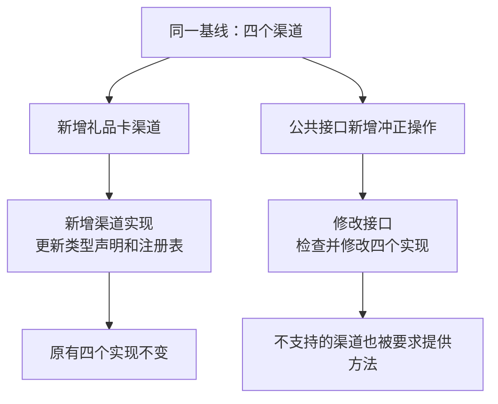
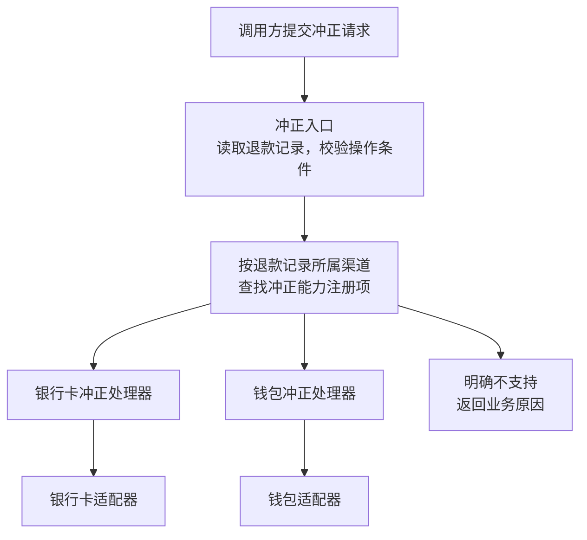
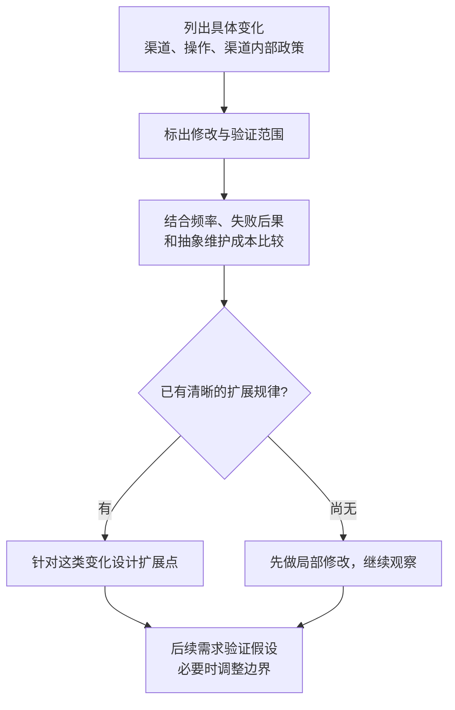

> 《编程思想》系列第 5/10 篇。这一季的立论在[序章](/zh/notes/programming-taste-in-the-agent-era/)。
>
> AI 能替我们写的代码越来越多，程序员自己攒下的经验和底层判断因此更值钱。这个系列是我把这些上了年纪的原则重新翻出来，一条条查它们的出处、边界和失效场景的记录。温故而知新。

[第 2 篇](/zh/notes/what-belongs-in-one-module/)讨论过一个退款处理模块 `RefundHandler`。这段退款逻辑后来按渠道拆成了四个模块，分别处理银行卡、钱包、线下转账和积分补偿。每个模块负责相应渠道的超时、重试和幂等策略。

在退款逻辑按渠道拆分完成后的第三个月，产品经理提出了两个新需求：增加一个礼品卡退款渠道，并为各个退款渠道增加冲正操作。

接入礼品卡渠道需要新增一个渠道实现，并将它接入注册表。这次开发连同测试花了半天，原有的退款提交流程没有修改。

冲正需求涉及的改动范围更广。按这个退款系统的业务约定，冲正会为已结算的退款生成反向记录，同时保留原记录。如果把冲正操作加进所有渠道共用的接口，就需要逐个检查和修改现有渠道实现。

为什么同一份设计，一种需求加得很顺，另一种却牵动许多地方？差别在变化的方向：前者增加一种渠道，后者给渠道增加一种操作。下文把它们称为两条「变化轴」。

**开闭原则需要回答的是：面对哪类变化，哪些已有代码可以保持稳定？** 把这句话里的对象补全，才有办法讨论设计是否合适。

## 加渠道：变化停在接入处

这套退款代码将调度和具体处理分开：调用方根据请求找到对应渠道，再由该渠道模块执行退款。理解这个分工，就能看出新需求会影响哪部分代码，无需先读完系列前文。

下面是结构示意，省略请求、回执的字段和各渠道内部实现；它用于比较改动范围，不是一套完整的支付代码。

```ts
interface RefundChannel {
  readonly kind: ChannelKind
  submit(req: RefundRequest): Promise<ChannelReceipt>
}

const channels = new Map<ChannelKind, RefundChannel>([
  ['card', new CardChannel(cardGateway)],
  ['wallet', new WalletChannel(ledger)],
  ['transfer', new TransferChannel(approvalFlow)],
  ['credit', new CreditChannel(couponStore)],
])

async function submitRefund(req: RefundRequest): Promise<ChannelReceipt> {
  const channel = channels.get(req.channel)
  if (!channel) throw new UnknownChannelError(req.channel)
  return channel.submit(req)
}
```

读这段代码时，留意最后一行：`submitRefund` 只调用 `submit`，不需要知道银行卡和钱包分别怎样处理退款。

如果礼品卡渠道能够遵守 `RefundChannel` 定义的提交约定，就可以用新增的 `GiftCardChannel` 实现它。为了将这个实现接入提交流程，还需要给 `ChannelKind` 增加 `'giftcard'`，并向 `channels` 注册表加入对应实例。

这次仍然修改了类型声明和注册表。保持不变的是 `submitRefund` 的调度逻辑，以及原来四个渠道的实现。新增实现也仍需测试，包括它接进流程后能否正常工作。

**这里获得的好处，是新渠道的接入没有要求我们重写已有渠道。** 如果新渠道需要一套不同的提交约定，这份接口也可能需要重新设计。

## 加操作：现有实现需要一起改

为了看清两类改动的差别，下面分别从最初四个渠道的版本出发比较。若礼品卡已经接入，增加公共方法时还要把它算进去。

对于产品经理提出的冲正需求，一种直接的实现方式是在所有退款渠道共用的 `RefundChannel` 接口上增加 `reverse` 方法：

```ts
interface RefundChannel {
  readonly kind: ChannelKind
  submit(req: RefundRequest): Promise<ChannelReceipt>
  reverse(receipt: ChannelReceipt, reason: string): Promise<ChannelReceipt>
}
```

这份声明要求每个渠道都提供 `reverse`。按一个接口文件、每个渠道一个实现文件计算，需要检查接口和四个实现，共五处；调用方、测试和接入配置另计。

本例约定银行卡和钱包支持冲正，线下转账和积分补偿不支持。如果仍要求后两者实现这个方法，积分补偿类里就可能出现下面的代码。这里只摘出新增的方法，其余成员省略：

```ts
async reverse(): Promise<ChannelReceipt> {
  throw new UnsupportedOperationError('credit')
}
```

类型检查可以接受一个始终抛错的方法，但调用方从 `RefundChannel` 这个类型上看不出哪些渠道能完成冲正。于是，新增方法同时带来了两项工作：修改现有实现，以及决定在哪里处理不支持的情况。

两次改动的区别可以放在一张图里：



图里比较的是这份拆分方式下的改动范围。它说明按渠道拆分方便了增加渠道，同时让增加公共操作的工作分散到了各个实现中。

## 换一种切法，改动会落在哪里

可以把退款逻辑想成一张表。每一行是一种渠道，每一列是一种操作，每个格子回答「这个渠道如何执行这个操作」。

| 渠道 | 提交退款 | 冲正 |
|---|---|---|
| 银行卡 | 银行卡的提交逻辑 | 银行卡的冲正逻辑 |
| 钱包 | 钱包的提交逻辑 | 钱包的冲正逻辑 |
| 线下转账 | 线下转账的提交逻辑 | 本例不支持 |
| 积分补偿 | 积分补偿的提交逻辑 | 本例不支持 |

前面的渠道类把同一个渠道的操作放在一起，对应表中的一整行。因此，增加一个渠道时，新逻辑主要集中在新增的渠道类中；增加一个公共操作时，则需要到现有的各个渠道类中补充实现。

也可以把同一列放在一起：渠道的数据用可辨识联合表示，`submit`、`reverse` 等操作各有一个入口。下面只展示冲正入口如何分派；`cardGateway` 和 `ledger` 是已有适配器，实际的反向记账由它们完成。

```ts
type Refund =
  | { kind: 'card'; receiptId: string; settledAt: Date }
  | { kind: 'wallet'; entryId: string }
  | { kind: 'transfer'; instructionId: string; approved: boolean }
  | { kind: 'credit'; couponId: string }

// reverse.ts：只展示分派，省略导入和适配器内部逻辑
export async function reverse(
  r: Refund,
  reason: string,
): Promise<ChannelReceipt> {
  switch (r.kind) {
    case 'card':
      return cardGateway.reverse(r.receiptId, reason)
    case 'wallet':
      return ledger.reverse(r.entryId, reason)
    case 'transfer':
    case 'credit':
      throw new UnsupportedOperationError(r.kind)
    default:
      return assertNever(r)
  }
}

function assertNever(value: never): never {
  throw new Error('Unhandled refund channel')
}
```

这里的 `reverse.ts` 集中了「各渠道怎样响应冲正」的分派。它没有修改原来的提交入口；适配器若还不具备冲正能力，仍需补充实现。新建一个分派文件，并不等于完成了整个业务需求。

换成这种组织方式后，再增加礼品卡，就需要扩展 `Refund`，并检查每个按渠道分支的操作。两种基础写法的代价如下：

| 组织方式 | 增加一种渠道 | 增加一种操作 |
|---|---|---|
| 按渠道组织，每个渠道一个类 | 新增一个渠道实现，更新类型和接入配置 | 修改公共接口，检查 N 个渠道实现 |
| 按操作组织，每个操作一个入口 | 扩展联合类型，检查 M 个操作入口 | 新增一个操作入口及所需业务实现 |

N 是渠道数，M 是操作数。表里比较的是代码组织带来的检查与改动范围，测试、适配器内部实现和部署工作需要另外计算。

Philip Wadler 在 1998 年的《The Expression Problem》邮件里，用行与列说明了这种张力。他提出的问题是：怎样同时方便地增加数据种类和操作，并保留静态类型安全、独立编译等性质。[4]

因此，这张表的适用范围是上面两种基础组织方式。它没有证明所有设计都只能照顾一个方向；更复杂的机制可以改变取舍，只是也需要评估额外成本。

### 让编译器指出遗漏

代码里的 `assertNever` 用来检查是否处理了联合类型的所有成员。已有分支都处理完后，剩余类型应当是 `never`。如果加入 `'giftcard'` 却没补对应分支，传入 `assertNever` 的值就还可能是礼品卡，TypeScript 会报类型错误。[7]

普通的 `default: throw` 会接住所有遗漏，让这种检查失去作用。上面的 `default: return assertNever(r)` 则明确要求编译器验证「没有遗漏」。另一种写法是省略 `default`，开启 `strictNullChecks`，并声明不包含 `undefined` 的返回类型；这些前提会影响编译器能否报错。[7]

我原本以为，发现遗漏是联合类型这版独有的好处。核对后发现，给接口增加必需方法，显式实现接口的类如果漏了该方法，也会编译失败。

两边检查的遗漏不同：一边是某个操作漏掉了新渠道，另一边是某个渠道漏掉了新操作。它们都无法仅凭签名确认冲正是否正确完成；那个只会抛错的方法就是例子。

## 开闭原则保护的是选定的变化

回头看「对扩展开放，对修改封闭」，可以把它落到具体模块上：新增礼品卡时，`submitRefund` 能调用新行为，同时保留原来的调度代码。

Meyer 在 1988 年提出开闭原则时，讨论的扩展机制主要是继承；Martin 后来通过抽象接口和多态解释如何让客户端保持稳定。[1][2] 本文的 `RefundChannel` 属于后一种写法。继承中父类变化可能影响子类的边界问题，留到第 10 篇讨论合成复用时展开。

Martin 在 1996 年原文的「Strategic Closure」一节已经写到：有意义的程序无法对所有变化都封闭，设计者需要选择要保护的变化种类。[3] 选择增加渠道这个方向，公共提交接口可以稳定；选择增加操作这个方向，就可能需要另一种组织方式。

这里不必把「改过旧文件」本身当作失败。Martin 在 2013 年还专门澄清过早年的强硬措辞：他希望预期内的行为变化不必引发整个系统的大范围修改，并没有要求从此不再修改源码。[8]

这个目标也比「只新增一个文件」更有用。注册表改一行、重写一段结算逻辑，都算修改旧文件，风险却可能相差很大。

## 接口和 switch，都要看适用范围

公共接口要求所有渠道都有 `reverse`，但本例只有两个渠道支持它。可以把冲正能力放进单独的 `ReversibleChannel`，让需要冲正的调用方依赖这份能力接口。

如果将冲正能力从通用渠道接口中分离出来，积分补偿和线下转账就不必为了满足类型要求而添加抛错方法。判断某个渠道是否支持冲正的逻辑，也可以集中在一个入口或注册表中，不必散落到每个调用方。

这是一种合理的改进。它把「支持冲正」表达得更准确，但银行卡和钱包的冲正逻辑仍然需要编写、测试。若以后持续增加新操作，还要评估这些能力接口和实现的维护成本。

评估一个 `switch` 是否合适，也需要看它承担了哪些职责。如果 `switch` 所在的入口只负责选择渠道，具体业务仍可交给渠道适配器；如果同一个函数还负责超时、重试、审批和记账，不同规则的修改就容易相互牵动。

第 2 篇按渠道拆开，是为了把各渠道内部的政策变化隔开。本篇按操作比较，是为了看清新增公共操作的代价。这两种需求可以同时存在：操作入口负责分派，渠道模块保留自己的业务细节。是否需要这种组合，取决于它能否减少实际的维护负担。

所以，检查一个 `switch` 时，可以追踪一次具体变化：新增渠道要补哪些分支？修改审批规则会影响哪些路径？调用方是否需要知道每个渠道的细节？这些答案比语法本身更能说明问题。

## 渠道和操作都增加时，我会怎样设计

如果这个退款系统已经持续增加渠道和操作，我会保留独立的渠道适配器，为每种操作设置自己的入口，再用显式的能力注册表连接两者。这是针对本文场景的设计建议，目标是让新增业务有明确的位置，并限制它对已有业务的影响。

这个方案包含三个分工。渠道适配器保留银行卡接口、钱包账本等外部依赖及各自的内部规则；操作入口定义本次操作的请求、结果和处理流程；注册表记录某个渠道是否支持这项操作，以及支持时应调用哪段处理逻辑。

以冲正为例，调用过程可以安排成这样：



入口从退款记录确定渠道，再调用对应处理器。银行卡处理器可以复用银行卡适配器，钱包处理器可以复用钱包账本逻辑。这样，冲正流程有集中入口，渠道内部的超时、重试和幂等约定也有明确的归属。

代码可以按下面的方式安排。这里展示职责位置，处理逻辑很短时可以留在操作模块里，不必为了目录整齐强行拆文件。

```text
refund/
  channels/
    card.ts                 银行卡适配器与内部规则
    wallet.ts               钱包适配器与内部规则
  operations/
    submit.ts               原有提交入口及契约
    reverse.ts              冲正入口及契约
    reverse/
      card.ts               银行卡冲正处理器
      wallet.ts             钱包冲正处理器
  composition.ts            注册渠道能力，连接入口与处理器
```

`submit` 和 `reverse` 保留各自的请求与结果类型。`composition.ts` 汇总它们各自的注册项，不需要把所有操作塞进一个接收任意参数的通用接口。渠道和回执之间的对应关系仍需由类型与入口校验共同保护，不能因为改用注册表就省去这些约束。

注册项需要区分三种情况：已经支持并关联处理器、业务上明确不支持、尚未配置。前两种是完整的能力决定，第三种是需要修复的遗漏。如果产品要求某个渠道支持冲正，就必须实现该能力，或明确与产品调整范围；给它配置「不支持」本身不能算完成需求。运行时展示的能力列表可以来自注册表，但验收还要对照独立确认的产品需求，防止配置漏掉了一项应当支持的能力。

在这个结构下，两类新增需求的工作范围如下：

| 新需求 | 需要新增或修改的部分 | 可以保持稳定的部分 |
|---|---|---|
| 新增礼品卡渠道，当前只支持提交 | 增加渠道实现和提交处理逻辑；在现有操作的注册项中明确礼品卡的支持状态；补充接入与行为测试 | 既有银行卡、钱包等处理器；契约不变的操作入口 |
| 为银行卡和钱包新增冲正 | 增加冲正契约、入口、两个渠道的处理逻辑及注册项；适配器缺少所需能力时补充实现 | 原有提交入口，以及本次无需改变的渠道提交逻辑 |
| 以后让礼品卡也支持冲正 | 实现礼品卡冲正逻辑，把对应注册项从不支持改成已支持，并验证该组合的行为 | 冲正契约不变时的入口，以及其他渠道的冲正处理器 |

这份取舍保留了接入配置的修改，也接受新业务可能需要补充适配器。它换来的是：增加一种操作时，不必让所有渠道类都增加同一个方法；增加一种渠道时，也不必让每个操作入口都增加一条渠道分支。新增组合的连接关系集中在注册表，实际行为由对应的处理逻辑承担。

如果所有渠道都必须支持所有操作，N 个渠道与 M 个操作之间仍有 N × M 个组合需要作出能力决定。这不意味着一定要写 N × M 份不同代码，共同规则可以复用；但每个必要组合的语义与验证责任都需要明确。注册表不能替我们完成银行卡冲正，也不能让不具备冲正能力的渠道自动获得这项能力。

实际改造时，我会先保留现有提交路径，为冲正增加独立入口，并用清楚的 `switch` 完成最初的分派。当渠道和操作持续增长、多个入口重复维护渠道分支时，再把连接关系移入各操作的能力注册表。对于只有少数渠道和操作的系统，前面的集中分派已经可能足够；在双向增长形成规律后，我会选择这里的组合方案。它是一项维护成本的取舍，不承诺满足表达式问题所要求的全部性质。

## 什么时候值得增加抽象

我以前把开闭当验收标准：改动老代码就是设计失败，于是每个接缝先铺一层接口，铺完自己都说不清那些接口挡的是哪类变化。

为每个接缝预先增加接口，会引入额外的理解和维护成本。维护者需要理解接口与实现之间的关系；如果接口预留的扩展方向与实际需求不符，下一次修改还可能需要绕过这层抽象。

Martin 在《Agile Software Development》中的一段话建议：变化发生时，建立能保护后续同类变化的抽象。[5] 这段话支持根据真实变化调整设计，不能直接推出「必须等第二次才抽象」。第一次变化就可能暴露出清楚的扩展需求；发生两次，也可能只是两个没有共同规律的特例。

可以把新增抽象当作一项需要说明收益的改动：它保护哪个模块？预计还会遇到哪些同类变化？现在增加的复杂度，能否换来后续更小的修改和验证范围？

答案还不清楚时，保留直接实现、观察下一次需求，是合理选择。已经有明确的接入计划或反复出现的同类改动时，就有更具体的依据设计扩展点。

抽象也可以撤回，但拆除成本需要单独评估。一个团队内部使用的接口，和多个团队已经依赖的公共扩展点，迁移难度不同。调用方、兼容承诺和验证范围都会影响决定，不能仅凭文件少就断言它容易拆掉。

## 把原则用在下一次改动上

Parnas 在讨论模块划分时，建议把可能变化的设计决策隐藏在模块内部。[6] 放到这里，可以用下面几个问题检查一次具体设计。

1. 写出候选变化。退款系统至少可以区分新增渠道、新增操作、修改某个渠道内部政策。尽量使用需求记录或已有计划，避免只凭想象预测。
2. 逐项标出修改和验证范围。包括接口、实现、注册表、调用方与测试。文件数可以帮助发现改动分散，但还要看是否重复表达了同一个业务决策。
3. 比较出现频率与失败后果。频繁增加渠道，按渠道扩展可能更划算；渠道稳定、操作持续增加，就值得评估按操作组织。一次冲正需求本身不足以证明操作已经成为主变化轴。
4. 比较改造成本与后续收益。扩展规律明确时，针对它增加抽象；规律尚不明确时，先做局部修改。两种方案收益接近，可以优先考虑依赖更少、迁移范围更可控的方案。



例如，注册表增加一项需要检查接入是否正确；修改冲正实现还需要验证反向记录、失败处理和幂等约定。两者即使恰好都改一个文件，也不代表工作量或风险相等。

## 我改了什么判断

现在看一份设计，我会先问：它预计会遇到哪类变化，又把这类变化限制在了哪里？然后沿着一个真实需求，看需要修改什么、重新验证什么，以及哪些已有模块可以保持稳定。

原先按退款渠道划分模块，让各渠道的内部规则可以分别维护。新增冲正这类公共操作时，公共接口又可能让改动波及多个渠道，因此需要重新评估模块边界。调整设计时，可以保留原有拆分中仍然有用的部分，并修改已经不适合新需求的部分，无需为了维持「从不修改」的形象继续增加接口。

对于渠道和操作都持续增长的情况，我会采用操作入口、渠道适配器和显式能力注册的组合，把修改集中到新的处理逻辑及其接入关系上。系统规模还小时，我会先保留直接分派，等实际维护负担证明需要再调整结构。选择的依据是哪些已有业务能够保持稳定，以及新增业务是否更容易实现和验证。

下一篇讲里氏替换。`CreditChannel.reverse` 的签名可以通过检查，但调用时始终抛错。它能否代替调用方期待的渠道，还取决于接口承诺了什么行为；这正是下一篇要继续检查的边界。

## 参考资料

1. [Bertrand Meyer, *Object-Oriented Software Construction*, Prentice Hall, 1988](https://dl.acm.org/doi/book/10.5555/534431) —— 保留原书出处；本次未直接核对原书。历史定义沿用前文记录，Martin 的原文也引用了该书。
2. [Robert C. Martin, “The Open-Closed Principle”, 1996，原文 PDF 镜像](https://www.cs.utexas.edu/~downing/papers/OCP-1996.pdf) —— University of Texas 教学站保存的完整文本；抽象与多态示例见第 3–5 页。
3. 同上，第 6 页 “Strategic Closure”。本次已核对 PDF 原文，替换旧稿中的二手转述依据。
4. [Philip Wadler, “The Expression Problem”, 1998-11-12](https://homepages.inf.ed.ac.uk/wadler/papers/expression/expression.txt) —— 邮件开头同时交代了行列类比和希望支持两个方向扩展的目标。
5. [Robert C. Martin, *Agile Software Development, Principles, Patterns, and Practices*](https://www.pearson.com/en-us/subject-catalog/p/agile-software-development-principles-patterns-and-practices/P200000009301) —— 该段措辞仍依据旧稿保存的 [Fanciful Magic 转述](http://blabux.blogspot.com/2003/11/fool-me-once.html)，本次未直接核对原书；不将其解释成固定次数规则。
6. [D. L. Parnas, “On the Criteria To Be Used in Decomposing Systems into Modules”, CACM 15(12), 1972](https://dl.acm.org/doi/10.1145/361598.361623) —— 第 2 篇使用过的模块划分依据。
7. [TypeScript Handbook — Union Exhaustiveness checking](https://www.typescriptlang.org/docs/handbook/unions-and-intersections.html#union-exhaustiveness-checking) —— 显式返回类型与 `strictNullChecks`、`never` 两种检查方式。
8. [Robert C. Martin, “An Open and Closed Case”, 2013-03-08](https://blog.cleancoder.com/uncle-bob/2013/03/08/AnOpenAndClosedCase.html) —— 作者对早年开闭原则措辞的澄清。
