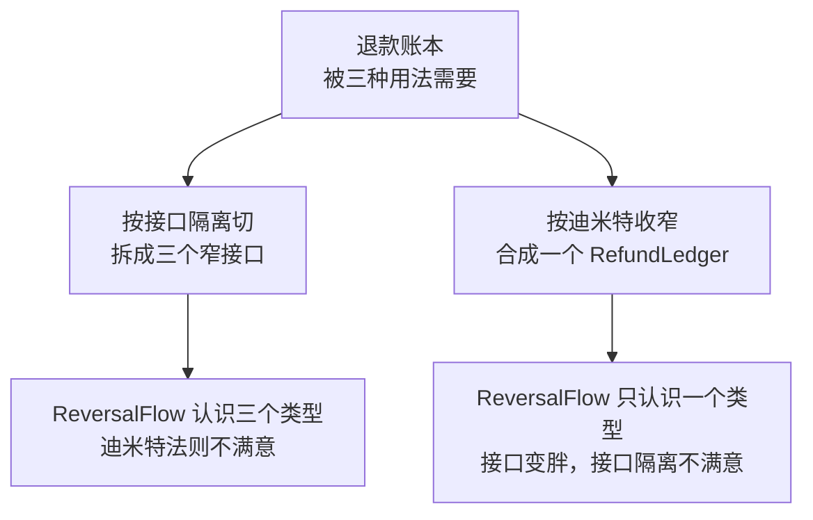

> AI 能替我们写的代码越来越多，程序员自己攒下的经验和底层判断因此更值钱。这个系列是我把这些上了年纪的原则重新翻出来，一条条查它们的出处、边界和失效场景的记录。温故而知新。

这是一份学习笔记，关于面向对象的七条设计原则。

写它的起因是一个不太好回答的问题。现在 agent 写代码比我快，写出来的东西大部分时候挑不出毛病，那么这些三十年前的原则还值不值得花时间。**答案是值得，但理由不在原则本身。**七条原则会在同一段代码上给出相反的建议，选哪一条，取决于猜这段代码接下来往哪个方向长。**这个判断目前还外包不出去。**

序章先把七条各自的出处交代清楚。查完出处之后，那张把它们摞成金字塔的图，我不打算照抄了。

## 出处

常见的画法是这样：底层是高内聚低耦合，中间是七条设计原则，上面是设计模式，顶上是面向对象开发。一层撑着一层，看着像一套推导出来的体系。

逐条查下来，它们是这么来的：

| 概念 | 提出者 | 年份 | 出处 |
|---|---|---|---|
| 内聚与耦合 | Stevens、Myers、Constantine | 1974 | 《Structured Design》，IBM Systems Journal 13(2)[1] |
| 里氏替换 LSP | Barbara Liskov | 1987 | OOPSLA keynote《Data Abstraction and Hierarchy》[2] |
| 迪米特法则 LoD | Ian Holland | 1987 | Northeastern University，Demeter 项目[3] |
| 开闭原则 OCP | Bertrand Meyer | 1988 | 《Object-Oriented Software Construction》[4] |
| 合成复用 CRP | GoF 四人 | 1994 | 《Design Patterns》 |
| 依赖倒置 DIP | Robert C. Martin | 1996 | C++ Report（成文稿见 2000 年汇编本[7]） |
| 接口隔离 ISP | Robert C. Martin | 1996 | C++ Report（成文稿见 2000 年汇编本[7]） |
| 单一职责 SRP | Robert C. Martin | 1990s | C++ Report，2000 年收进《Design Principles and Design Patterns》[7] |

六拨人，最早和最晚之间隔着二十二年。1974 年那三个人在讨论怎么把 Fortran 程序切成模块，1987 年 Liskov 在 OOPSLA 讲台上讨论的是类型论，1996 年 Martin 在给别人做咨询时遇到了具体的麻烦。**他们不认识彼此的问题，也不是在给同一套体系添砖。**

SOLID 这个缩写出现得更晚。五条原则是 Martin 在 1990 年代陆续写出来的，把首字母拼成一个词是 Michael Feathers 大约 2004 年做的事[5]，比原则本身晚了十几年。而中文教材里那张「七大原则」的并列表，比 SOLID 又多出两条——迪米特法则和合成复用从来不在 SOLID 里，它们一个来自 1987 年的东北大学，一个来自 1994 年的 GoF。

**这七条被摆在一起，是后人整理的结果。**

## 内聚和耦合的等级本身就是主观的

1974 年那篇文章给出了六种内聚：偶然、逻辑、时间、通信、顺序、功能。今天教材上常见的是七种——「过程内聚」是 Yourdon 和 Constantine 后来在书里补的，Myers 另外还加过两种。哪一版都不是定论。

后来有人做过一次测量。《Software Quality Journal》上的一项研究让 163 名学生给同一个中等规模 Fortran 程序里的模块标注内聚和耦合等级，结果分歧很大[6]。同一段代码，不同的人读出来的内聚等级不一样。

这不是说等级没用。**它说明这套东西从一开始就是判断量表，不是测量仪器。**

## 开闭原则有两代含义

七条里最常被引用的一句是**对扩展开放，对修改封闭**。这句话挂在 Meyer 名下，年份写 1988。

Meyer 1988 年说的是：一个类可以被编译进库、被别的类使用，这时它是「封闭」的；同时任何新类都可以拿它当父类、派生出新特性，这时它是「开放」的。做到开闭的手段是**实现继承**——把类打包进库，别人靠继承来扩展。这在当年是有针对性的：那时候往库里加字段或者加函数，依赖这个库的程序全都得改。

1990 年代 Martin 重新表述了它，改成依赖抽象接口，实现放在接口后面，靠多态替换来扩展。Martin 说自己是在转述 Meyer，但两个人对「怎么做到开闭」的回答不一样：一个说继承具体类，一个说依赖抽象接口[4]。

我原本把开闭原则理解成「面向接口编程」，并且理所当然挂在 Meyer 名下。读了 1988 年的原始表述才发现，**今天教的那套是 1990 年代改的，只是名字和年份还沿用着上一代。**

**这个区别不是考据癖。**Meyer 的版本里，扩展点是继承层级；Martin 的版本里，扩展点是接口。这两种扩展点会在什么时候失效、失效的样子长什么样，是两回事——这是第五篇和第十篇要处理的事。

## 迪米特法则得名于一个项目

顺带一件小事。迪米特法则不是某个姓 Demeter 的人提的。

它 1987 年秋天由 Ian Holland 在东北大学提出，当时他在 Demeter 项目组里。项目组把这条规则以项目名命名，而项目名取自希腊农业女神，用意是「像种庄稼一样让软件一小步一小步长出来」[3]。

Lieberherr 在东北大学挂了二十多年的那个页面上，这条法则只有一句话：只和你的朋友说话。

## 两条原则会在同一段代码上打架

前面说这七条不是一套体系，最直接的证据是它们会互相冲突。

接口隔离原则说，客户端不应该依赖它不需要的接口，接口要尽量细分。按这条切，退款账本的三种用法就该是三个接口：

```ts
interface RefundLookup   { findByOrder(orderId: string): Promise<Refund[]> }
interface RefundTimeline { stagesOf(refundId: string): Promise<Stage[]> }
interface RefundReversal { reverse(refundId: string, reason: string): Promise<void> }

class ReversalFlow {
  constructor(
    private lookup: RefundLookup,
    private timeline: RefundTimeline,
    private reversal: RefundReversal,
  ) {}
}
```

迪米特法则说，一个对象应该对别的对象有最少的了解。按这条看，上面那个 `ReversalFlow` 认识三个类型，多了。收窄成一个：

```ts
class ReversalFlow {
  constructor(private ledger: RefundLedger) {}
}
```

现在 `ReversalFlow` 只认识一个类型，迪米特满意了。但 `RefundLedger` 得同时提供查询、时间线和冲正，是个胖接口，接口隔离不满意。

**两条原则都没被误用，它们指向相反的方向。**多一个窄接口就是多一个类型，而少一个类型就意味着接口得变宽。**这里没有正确答案，只有取舍。**接口是抽象类型，转发方法是具体代码，前者的成本通常低于后者——但这是我的取舍，不是原则算出来的结论。

同一段代码，两条原则各拉一边，中间没有裁判：



画出来之后更容易看清这里没有最优解：三条路都合规，差别只在于这次更想付哪一笔成本。

## 那张金字塔图

我原本以为这七条是层层递进的，底下垫着高内聚低耦合，顶上架着设计模式，一层推出一层。查完出处，这个结构不成立：它们出自六拨互不相干的人，各自解决各自的麻烦，中间隔着二十二年，而且会在同一段代码上给出相反的建议。

**金字塔是后来为了讲课方便画出来的叙事。**

更接近实际的说法是，**这七条是七个提问角度**。改这段代码的时候会有几个人来找我（单一职责）；这段代码会往哪个方向长（开闭）；这个子类替换父类之后，原来的断言还成立吗（里氏替换）。**角度之间没有优先级**，因为回答哪个问题更重要，取决于代码的处境。

**Agent 能把七条里的任何一条实现得比我快。它答不了的是这次该听哪一条。**

## 照搬原则会写出反原则的代码

查完出处，接下来要回答的是：这些年份和人名对写代码有什么用。

用处不在考据，在于**每条原则诞生时都带着它要解决的那个具体麻烦**。1974 年那三个人面对的是怎么把一坨 Fortran 切成模块；1988 年 Meyer 面对的是往库里加一个字段就得让所有依赖方重编；1996 年 Martin 面对的是咨询项目里甲方改需求改得他疲于应付。每条原则都是对某个具体麻烦的一次回答，不是从公理推出来的结论。

麻烦在传抄里丢得最快。原则被人从论文里摘成一句口号，从口号抄进教材，从教材变成代码评审的口头禅。走到这一步，它只剩措辞，当初那个麻烦早不在场了。「对扩展开放，对修改封闭」听着无懈可击，可 Meyer 写下这句话时，他手上那个「扩展」指的是继承一个已经编译进库的类。

丢了场景的口号会变成验收标准，而**验收标准是可以靠堆结构通过的**。于是每个接缝先铺一层接口，每个类拆到只剩一个方法，评审时条条合规。多出来的那层间接性挡不住任何一次真实的变化，它挡的只是「看起来不符合原则」这句评语。

**这样写出来的代码同时犯两个错：既没有拿到原则想保护的那种可修改性，又比不套原则时臃肿。**反原则，且更重。

所以判断该不该用一条原则，问的不是「这样符不符合原则」，而是**「这段代码接下来会往哪个方向长，谁会来提要求」**。这两个问题的答案在业务里，不在原则里。

后面九篇都用同一个写法：把原则放回它诞生的场合，看清它当时在防什么，再拿回来对照今天的场景，看那条防线还值不值得修。**对不上的时候，改的是用法，不是场景。**

## 这个系列用的例子

后面九篇的代码都从同一个地方长出来：一个退款与对账的子系统。选它是因为它的约束是硬的——**软的领域讲里氏替换只能讲成语法游戏**。

四条不变量，后面会反复回来：

1. 累计退款额不超过原订单实付额
2. 幂等，同一笔退款重复提交不产生第二次资金流动
3. 状态单向，已结算不可回退，只能追加一笔反向记录
4. 币种一致，跨币种不可相加

退款有四种渠道（原路退卡、钱包余额、线下转账、积分补偿），四类客户端（客服后台、财务对账、风控拦截、商家只读）。这个结构里天然带着**两条互相冲突的扩展轴**：加渠道，和加操作。第五篇会用它来讲为什么开闭原则只能对其中一条开放。

## 系列地图

- 序 · 七条设计原则不是一座金字塔
- 内聚 · 判据是「必须一起改」，不是「看起来相关」
- 耦合 · 三种看不见的耦合，和一次假解耦
- 单一职责 · 职责不是一件事，是一个会来提要求的人
- 开闭 · 对扩展开放，对修改封闭
- 里氏替换 · 签名对了不代表能换
- 依赖倒置 · 倒置的是接口的归属
- 接口隔离 · 接口是客户端视角的切片
- 迪米特 · 得墨忒耳与中间人的两难
- 合成复用 · 继承会把不变量公开出去

每篇一条，逐篇更新。

## 这篇的结论

- **七条原则不是一套体系。**六拨人、二十二年、互不相干的麻烦，把它们摆在一起是后人整理的结果。那张金字塔是为了讲课方便画出来的叙事。
- **它们是七个提问角度，角度之间没有优先级。**该问哪一个，取决于这段代码接下来往哪个方向长、谁会来提要求。
- **内聚和耦合的等级是判断量表，不是测量仪器。**163 个人能给同一段代码标出不同等级，这不是学生的失败，是量表本来就依赖场景。
- **同一段代码上，两条原则可以给出相反的指示，且都没有被误用。**接口隔离和迪米特在上面那段 `ReversalFlow` 上就是这么打架的。
- **原则诞生时都有具体场景，传抄过程中场景会丢。**丢了场景的口号会变成验收标准，而验收标准可以靠堆结构通过。
- **照搬原则的代价是写出反原则且更臃肿的代码。**多出来的间接层既没有挡住任何真实变化，又增加了一条依赖。
- **Agent 能把七条里的任何一条实现得比我快，它答不了的是这次该听哪一条。**这个判断外包不出去，正是这一系列要练的。

## 参考资料

1. [W. P. Stevens, G. J. Myers, L. L. Constantine, "Structured Design", IBM Systems Journal 13(2), 1974, 115–139](https://dl.acm.org/doi/10.1147/sj.132.0115)
2. [Barbara Liskov, "Keynote address — Data Abstraction and Hierarchy", OOPSLA '87 Addendum，收录于 ACM SIGPLAN Notices 23(5), 1988, 17–34](https://www.cs.tufts.edu/~nr/cs257/archive/barbara-liskov/data-abstraction-and-hierarchy.pdf)
3. [Karl Lieberherr, "Law of Demeter: Principle of Least Knowledge", Northeastern University](https://www.khoury.northeastern.edu/home/lieber/LoD.html)
4. [Open–closed principle — 两代表述的对照](https://en.wikipedia.org/wiki/Open%E2%80%93closed_principle)
5. [SOLID — 缩写的来历](https://en.wikipedia.org/wiki/SOLID)
6. [Difficulties using cohesion and coupling as quality indicators, Software Quality Journal](https://link.springer.com/article/10.1007/BF00590439)
7. [Robert C. Martin, "Design Principles and Design Patterns", Object Mentor, 2000. SRP、DIP、ISP 三条的成文章节都收在这份汇编里；C++ Report 原刊找不到稳定的在线链接](https://www.fil.univ-lille.fr/~routier/enseignement/licence/coo/cours/Principles_and_Patterns.pdf)

关于第 5 条：SOLID 这个缩写归于 Michael Feathers，目前能找到的都是二手来源互相印证，没有他本人或 Martin 的一手确认。这条按「一般认为」处理。
