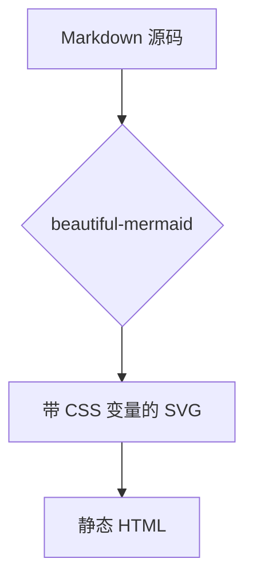

这篇是**样例文章**，用来验证排版规则是否生效。写完真正的第一篇之后可以删掉。

Kami 的设计哲学可以压缩成一句话：*暖羊皮纸画布、单一油墨蓝强调、衬线承载层级、拒绝冷灰与硬投影*。

## 强调的两种形态

上面那句用了 `*` 包裹，在中文页面里它应该渲染成**着重号**而不是斜体 —— 浏览器对中文的 italic 是伪斜体，把字形强行倾斜，非常难看。着重号才是中文印刷传统的正统做法。

而 `**` 包裹的部分是油墨蓝，**字重没有变化**。这是 Kami 最有辨识度的一条：需要更强存在感时用颜色、字号或左侧竖线，而不是加粗。

### 代码

行内代码像 `getAvailableLocales()` 这样。代码块的语法高亮主题在 P2 接入：

```python
async def embed(chunks: list[str]) -> Vectors:
    resp = await client.embeddings(model="bge-m3", input=chunks)
    return Vectors.from_raw(resp.data, dim=1024)
```

> 引用块靠填充色浮起，不画闭合边框 —— 单边竖线承担重量。

### 图表

Mermaid 图表在构建期渲染成 SVG，浏览器里不加载任何图表库：



## 清单与表格

- 底色永不纯白
- 所有灰色必须暖调
- 强调色不超过版面的 5%

| 角色 | 色值 |
| --- | --- |
| 羊皮纸 | `#f5f4ed` |
| 油墨蓝 | `#1B365D` |
| 暖棕 | `#8b4513` |

移植过程中唯一刻意偏离的是字号阶：Kami 的阶梯是印刷 pt 值，换算到屏幕正文只有 13px，那是纸上的密排值。[^1]

[^1]: 这里保留了 Kami 的比例关系，把正文锚定在 17px 重算整个阶梯。
